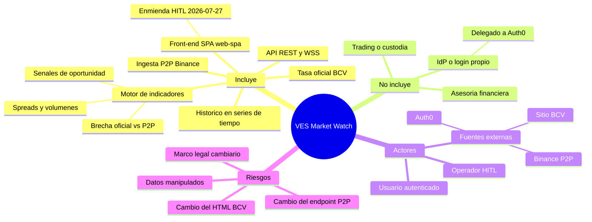

# Project Charter — VES Market Watch

- **Estado:** approved (Gate 0, HITL 2026-07-11) — residual en seguimiento: ratificación
  del marco legal cambiario (HITL). El de «nombrar apps consumidoras» quedó cerrado por
  la enmienda 2026-07-27 (ADR-0017: `apps/web-spa`); falta identificar a los **usuarios**
  del piloto
- **Fecha:** 2026-07-27
- **Decisores:** Jeremi Alcalá
- **Sponsor / Owner:** Jeremi Alcalá
- **Fase AI-DLC:** 00-project
- **Versión:** 0.3.0

> Enmienda 2026-07-27 (HITL, Jeremi Alcalá — ADR-0017): el front-end/SPA consumidor,
> originalmente en no-scope como «proyecto aparte», se incorpora al alcance del
> monorepo como `apps/web-spa`. Con ello se resuelve además el residual «nombrar
> apps consumidoras concretas»: la primera app consumidora es el propio dashboard.

## Visión

Dar a personas y aplicaciones una visión consolidada, en tiempo casi real, de la brecha
entre el tipo de cambio oficial VES/USD (BCV) y el mercado P2P VES/USDT (Binance), con
indicadores financieros que apoyen la administración eficiente del presupuesto mensual.

## Alcance

- Incluye:
  - Ingesta continua de publicaciones P2P de Binance (VES/USDT): precios, cantidades,
    límites, bancos y métodos de pago.
  - Ingesta de la tasa oficial VES/USD publicada por el BCV (2 consultas/hora).
  - Motor reactivo de indicadores: brecha BCV↔Binance, spreads de compra/venta,
    diferencial porcentual, volúmenes agregados, profundidad de mercado, variaciones
    intradía, tendencias de liquidez y señales de oportunidad.
  - Exposición vía API REST (histórico + indicadores) y WebSocket (eventos en tiempo real).
  - Front-end/SPA web (`apps/web-spa`): dashboard React autenticado vía Auth0 que
    consume la API REST y el WSS *(incorporado por enmienda HITL 2026-07-27 —
    ADR-0017; antes en no-scope como «proyecto aparte»)*.
  - Persistencia histórica en series de tiempo para análisis.
- **No incluye (no-scope):**
  - Ejecución de operaciones de compra/venta (no es un bot de trading).
  - Custodia de fondos, wallets o integración transaccional con Binance.
  - Asesoría financiera; los indicadores son informativos.
  - Construir un IdP/login propio: la autenticación de usuarios se delega a Auth0 (OIDC,
    ADR-0012); el login usa la Universal Login hospedada de Auth0.
  - Otras criptomonedas o pares distintos de VES/USDT y VES/USD en la fase inicial.

*Eje trazabilidad — fase 00 / Gate 0: mapa de alcance y actores del charter (lenguaje ubicuo en `glossary.md`).*

## Stakeholders

| Rol | Nombre | Responsabilidad |
| --- | --- | --- |
| Product Owner / Dev | Jeremi Alcalá | Visión, decisiones de diseño, aprobación de gates |
| Usuarios consumidores | `<TODO: identificar>` (personas del piloto; la **app** consumidora ya existe: `apps/web-spa`, ADR-0017) | Consumo de API/WSS; se autentican vía Auth0 (OIDC) |

## Restricciones y supuestos

- Binance no ofrece API pública oficial documentada para P2P; se usa el endpoint público
  de consulta del portal P2P con límites de tasa conservadores (ver ADR-0005).
- El BCV publica la tasa en su sitio web; el formato HTML puede cambiar sin aviso y el
  certificado TLS del sitio ha presentado problemas históricos (ver ADR-0006).
- Presupuesto de infraestructura personal/reducido: preferencia por servicios ligeros
  y auto-hospedables (RabbitMQ, PostgreSQL/TimescaleDB).
- Zona horaria de referencia: America/Caracas (VET, UTC-4).

## Métricas de éxito del proyecto

- Latencia snapshot P2P → indicador publicado ≤ 30 s (p95).
- Tasa oficial BCV sincronizada con desfase ≤ 30 min de su publicación.
- Disponibilidad de la API/WSS ≥ 99 % mensual.
- Histórico consultable de al menos 12 meses sin degradación de consultas (< 2 s p95).
- Cero baneos permanentes de IP por parte de Binance (respeto de rate limits).

## Riesgos de alto nivel

| Riesgo | Impacto | Mitigación |
| --- | --- | --- |
| Binance cambia/bloquea el endpoint P2P | Pérdida de la fuente principal | Backoff adaptativo, monitoreo de esquema, abstracción de la fuente (puerto/adaptador) |
| Cambio de estructura del sitio BCV | Pérdida de tasa oficial | Parser tolerante, validación de rangos, alerta al fallar N consultas |
| Datos anómalos (ads manipulados) contaminan indicadores | Señales erróneas | Filtros de outliers, mediana/VWAP sobre top-N, escenarios de abuso en PRD |
| Marco legal cambiario venezolano | Riesgo regulatorio del uso de datos | Solo datos públicos, sin ejecución de operaciones; `<TODO: validación humana>` |
