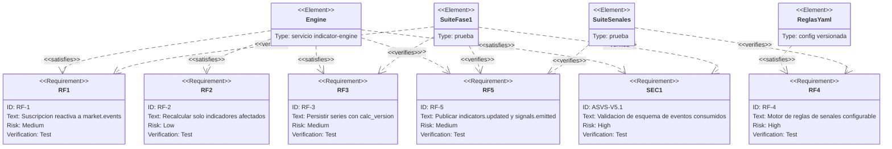

# PRD — Motor de Indicadores

- **Estado:** approved (Gate 0, HITL 2026-07-11) — implementado extremo a extremo en
  `apps/indicator-engine`: fase 1 (tasas oficiales, 2026-07-05), fase 2 P2P/microestructura
  (2026-07-20) y motor de reglas de señales (RF-4, 2026-07-22, ADR-0015) que emite
  `signals.emitted` (`signal.v1`). Pendiente solo la recalibración HITL de umbrales (subir la
  versión del ruleset) y mejoras menores (profundidad por bandas, variación intradía).
- **Fecha:** 2026-07-11
- **Decisores:** Jeremi Alcalá
- **Fase AI-DLC:** 01-requirements
- **Versión:** 0.2.0

## Problema y contexto
Consolidar los eventos de las fuentes (P2P y BCV) y producir indicadores financieros de
forma reactiva: cada nuevo dato recalcula y publica los indicadores afectados.

## Objetivos / No-objetivos
- Objetivos: calcular y versionar los indicadores listados abajo; publicarlos como eventos
  `indicators.updated` y `signals.emitted`; persistirlos como series de tiempo.
- No-objetivos: recomendaciones financieras personalizadas; ejecución de operaciones;
  modelos predictivos ML (fase posterior).

## Indicadores iniciales
| Indicador | Definición |
|---|---|
| Brecha BCV↔P2P (abs y %) | Precio referencia P2P − tasa oficial; y su % sobre la oficial |
| Spread de compra / venta | Distancia del mejor precio de cada lado al precio de referencia |
| Precio de referencia P2P | Mediana y VWAP del top-N de anuncios filtrados por lado |
| Volumen agregado compra/venta | Suma de cantidades disponibles por lado |
| Profundidad de mercado | Volumen acumulado por nivel de precio (bandas de 0,5 %) |
| Evolución de volumen intradía | Serie del volumen agregado por intervalo (5 min) |
| Tendencia de liquidez | Pendiente del volumen/profundidad en ventana móvil |
| Variación intradía | Δ de precio de referencia vs. apertura del día (VET) |
| Señales de oportunidad | Reglas configurables (umbral de brecha, spread anómalo, caída de liquidez) |

## Usuarios y escenarios
### Escenarios positivos
1. Llega `p2p.snapshot` → filtra outliers, recalcula indicadores P2P y brecha, publica
   `indicators.updated` y persiste.
2. Llega `official.rate.updated` → recalcula brecha y señales dependientes.
3. Una regla de señal se dispara → publica `signals.emitted` con evidencia (inputs, regla).

### Escenarios negativos / abuso (requerido por Gate 0)
1. **Snapshot con outliers extremos** (ads manipulados): filtrado por MAD/IQR sobre el
   top-N; si > 30 % del snapshot es outlier, se marca `low_confidence` y las señales se
   suprimen (integridad, A08).
2. **Evento duplicado o fuera de orden** (reentrega del broker): idempotencia por
   `snapshot_id` y ventana de ordenación; nunca doble emisión de la misma señal (A08).
3. **Tasa oficial `stale`**: la brecha se publica con bandera `official_stale=true`;
   las señales que dependen de ella se degradan, no se inventan datos (A10).
4. **Evento con esquema inválido inyectado al bus**: validación contra schema y descarte
   a dead-letter queue con alerta (A05, A08).
5. **Tormenta de eventos** (ingesta en bucle): backpressure y coalescing — se procesa el
   último snapshot por lado, no la cola completa (DoS interno, A10).

## Requisitos funcionales
- RF-1: Suscripción reactiva a `market.events` (p2p.snapshot, official.rate.updated).
- RF-2: Recalcular solo indicadores afectados por el evento recibido.
- RF-3: Persistir indicadores como series de tiempo con `calc_version` (reproducibilidad).
- RF-4: Motor de reglas de señales configurable sin redeploy (config versionada).
- RF-5: Publicar `indicators.updated` / `signals.emitted` al bus para el api-gateway.

*Eje trazabilidad — fase 01 / Gate 0, actualizado a la implementación: RF-1/2/3/5 y la validación de esquema (ASVS V5.1) satisfechos y verificados por la suite. RF-4 (señales, `ReglasYaml`) quedó satisfecho por el motor de reglas versionado (RF-4/ADR-0015, 2026-07-22) y verificado por `SuiteSenales` (reglas, cooldown, contrato del productor, e2e en vivo). RF-5 se completa: el engine ya publica tanto `indicators.updated` como `signals.emitted`.*

## Requisitos de seguridad (mapeados a OWASP ASVS)
| Req | ASVS | Nivel | OWASP Top 10 |
|---|---|---|---|
| Validación de esquema de todos los eventos consumidos | V5.1 | L1 | A05, A08 |
| Idempotencia y deduplicación por identidad de evento | V13 | L2 | A08 |
| Dead-letter queue + alerta para eventos inválidos | V16 | L1 | A09, A10 |
| Config de reglas firmada/versionada en repo (no editable en runtime sin auditoría) | V14 | L2 | A02, A08 |
| Trazabilidad: cada señal referencia sus inputs y versión de cálculo | V16 | L1 | A09 |

## Métricas de éxito
- Evento fuente → indicador publicado ≤ 5 s (p95); ≤ 30 s extremo a extremo con ingesta.
- 0 señales duplicadas; 0 señales emitidas desde datos `low_confidence`.

## Dependencias y riesgos
- Depende de: ambos ingestores, RabbitMQ, TimescaleDB.
- Riesgo: definición de umbrales de señal — `<TODO: calibrar con datos reales (HITL)>`.
