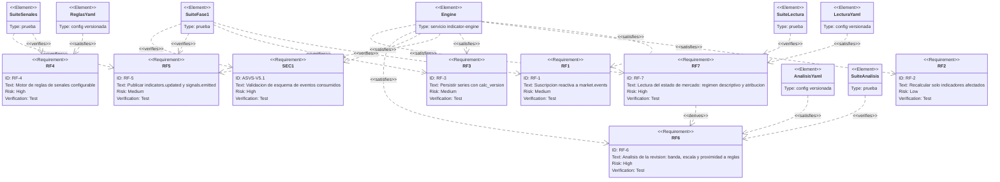

# PRD — Motor de Indicadores

- **Estado:** approved (Gate 0, HITL 2026-07-11) — implementado extremo a extremo en
  `apps/indicator-engine`: fase 1 (tasas oficiales, 2026-07-05), fase 2 P2P/microestructura
  (2026-07-20), motor de reglas de señales (RF-4, 2026-07-22, ADR-0015) que emite
  `signals.emitted` (`signal.v1`), análisis de la revisión (RF-6, 2026-08-01, ADR-0019)
  que emite `analysis.updated` (`analysis.v1`) y lectura del estado de mercado (RF-7,
  2026-08-01, ADR-0021) en el campo `reading` de ese mismo evento. Pendiente solo la
  recalibración HITL de umbrales (subir la versión del ruleset y la de la lectura) y
  mejoras menores (profundidad por bandas, variación intradía).
- **Fecha:** 2026-07-11
- **Decisores:** Jeremi Alcalá
- **Fase AI-DLC:** 01-requirements
- **Versión:** 0.6.0

## Problema y contexto
Consolidar los eventos de las fuentes (P2P y BCV) y producir indicadores financieros de
forma reactiva: cada nuevo dato recalcula y publica los indicadores afectados.

## Objetivos / No-objetivos
- Objetivos: calcular y versionar los indicadores listados abajo; publicarlos como eventos
  `indicators.updated` y `signals.emitted`; persistirlos como series de tiempo.
- No-objetivos: recomendaciones financieras personalizadas; ejecución de operaciones;
  modelos predictivos ML (fase posterior).

## Indicadores iniciales
| Indicador | Definición |
|---|---|
| Brecha BCV↔P2P (abs y %) | Precio referencia P2P − tasa oficial; y su % sobre la oficial |
| Spread de compra / venta | Distancia del mejor precio de cada lado al precio de referencia |
| Precio de referencia P2P | Mediana y VWAP del top-N de anuncios filtrados por lado |
| Volumen agregado compra/venta | Suma de cantidades disponibles por lado |
| Profundidad de mercado | Volumen acumulado por nivel de precio (bandas de 0,5 %) |
| Evolución de volumen intradía | Serie del volumen agregado por intervalo (5 min) |
| Tendencia de liquidez | Pendiente del volumen/profundidad en ventana móvil |
| Variación intradía | Δ de precio de referencia vs. apertura del día (VET) |
| Señales de oportunidad | Reglas configurables (umbral de brecha, spread anómalo, caída de liquidez) |

## Usuarios y escenarios
### Escenarios positivos
1. Llega `p2p.snapshot` → filtra outliers, recalcula indicadores P2P y brecha, publica
   `indicators.updated` y persiste.
2. Llega `official.rate.updated` → recalcula brecha y señales dependientes.
3. Una regla de señal se dispara → publica `signals.emitted` con evidencia (inputs, regla).

### Escenarios negativos / abuso (requerido por Gate 0)
1. **Snapshot con outliers extremos** (ads manipulados): filtrado por MAD/IQR sobre el
   top-N; si > 30 % del snapshot es outlier, se marca `low_confidence` y las señales se
   suprimen (integridad, A08).
2. **Evento duplicado o fuera de orden** (reentrega del broker): idempotencia por
   `snapshot_id` y ventana de ordenación; nunca doble emisión de la misma señal (A08).
3. **Tasa oficial `stale`**: la brecha se publica con bandera `official_stale=true`;
   las señales que dependen de ella se degradan, no se inventan datos (A10).
4. **Evento con esquema inválido inyectado al bus**: validación contra schema y descarte
   a dead-letter queue con alerta (A05, A08).
5. **Tormenta de eventos** (ingesta en bucle): backpressure y coalescing — se procesa el
   último snapshot por lado, no la cola completa (DoS interno, A10).

## Requisitos funcionales
- RF-1: Suscripción reactiva a `market.events` (p2p.snapshot, official.rate.updated).
- RF-2: Recalcular solo indicadores afectados por el evento recibido.
- RF-3: Persistir indicadores como series de tiempo con `calc_version` (reproducibilidad).
- RF-4: Motor de reglas de señales configurable sin redeploy (config versionada).
- RF-5: Publicar `indicators.updated` / `signals.emitted` al bus para el api-gateway.
- RF-6: **Análisis de la revisión.** Por cada lote de indicadores emitido, producir y
  publicar la lectura mecánica de los medidores del panel: en qué banda cae cada valor
  dentro de una escala de **percentiles reales** de su propia historia (ventana
  configurable), su posición de dibujo sobre esa escala con los cortes que la generan, y
  a cuánto está de cada umbral del ruleset que lo consume (`analysis.updated`).

  Reglas que lo acotan, todas verificables:
  - La escala usada **viaja en el payload** (`scale.source`): sin historia suficiente se
    cae a un respaldo con los umbrales reales del ruleset y se declara. Nunca se degrada
    en silencio.
  - Sin distribución empírica que la sostenga **no se emite banda** (`unscaled`): ni con
    el respaldo, ni cuando los cortes de la ventana coinciden entre sí.
  - Un indicador sin valor vigente **no produce lectura** y una condición cuyo indicador
    falta lleva `value: null`; jamás se rellena con el último conocido rancio.
  - El motor **clasifica** en vocabulario neutro de idioma; la prosa la redacta el cliente.
  - **No es un pronóstico**: nada de régimen predictivo, probabilidades ni horizontes
    temporales. La síntesis es proximidad aritmética a reglas ya versionadas, y
    `rules_met` no implica emisión (el cooldown pudo suprimirla).
    *(Enmienda 2026-08-01, ADR-0021: «régimen» aquí significaba —y sigue significando—
    el predictivo. RF-7 añade clasificación **del presente** con umbrales versionados,
    que es aritmética de la misma clase que estas bandas. Sin acotar el término, RF-6 y
    RF-7 se contradecían.)*
  - Un fallo del análisis **no** manda el snapshot a la DLQ ni impide publicar
    indicadores y señales.
- RF-7: **Lectura del estado de mercado.** Por cada revisión, además de la lectura de
  cada medidor (RF-6), producir una lectura del mercado **como un todo**, comprensible
  por quien administra su presupuesto mensual: el **régimen** —celda de una matriz de dos
  ejes, movimiento del paralelo × dinámica de la brecha, clasificados por umbrales de
  config versionada— y una lista **ordenada** de afirmaciones con sus cifras, que incluye
  la **atribución** de qué lado movió la brecha (`reading` en `analysis.updated`).

  Reglas que lo acotan, todas verificables:
  - **Describe el presente, no lo anticipa.** Ni pronósticos, ni probabilidades, ni
    horizontes temporales. El régimen es una clasificación reproducible a mano desde el
    payload, no un modelo.
  - **No aconseja.** Ninguna afirmación dice qué hacer; lo que orienta va en condicional.
    Es el no-objetivo «recomendaciones financieras personalizadas» aplicado.
  - **Si un eje no resuelve, no hay régimen.** Los ejes que sí resolvieron se publican:
    se omite la clasificación, no el dato. Media clasificación engañaría.
  - La **atribución se calla** cuando la oficial está rancia: la brecha se calculó contra
    una tasa vencida, así que decir quién la movió sería afirmar de más.
  - Solo se comentan las bandas **extremas**: en las intermedias, o con escala en
    respaldo, la frase orientativa sería falsa aunque suene bien.
  - El motor **clasifica** en códigos neutros de idioma; la prosa ES/EN la redacta el
    cliente, sin decidir nada sobre el orden.
  - La aclaración de que no es consejo ni pronóstico era **obligatoria** en la UI.
    **Enmienda 2026-08-02:** la aclaración deja de ESCRIBIRSE en la interfaz. La misma advertencia salía tres veces en el mismo dashboard y repetida tres veces deja de leerse; además la tarjeta debe describir el mercado en lenguaje llano, no describirse a sí misma. Lo que el requisito protege —que la prosa no aconseje ni prediga— **no se relaja**: sigue vigilado por la batería de expresiones prohibidas contra el texto renderizado, ahora en los dos idiomas y sin el apaño de recortar el pie antes de buscar dentro de él.

  **Ampliación 2026-08-01 — la brecha contra su propia historia.** Cada revisión
  publica además, por lado (compra y venta), la media y los extremos de la brecha en
  ventanas móviles de días, con los **días realmente cubiertos** de cada una.

  - `days_covered < days_configured` significa que la serie NO alcanza la ventana
    pedida. Se publica igual, declarándolo, para que el cliente rotule el tramo
    verdadero («Promedio 12 d de 30»). Mismo criterio que `scale.samples`.
  - La media se pondera **por hora, no por muestra**: el histórico derivado y la
    serie del motor tienen densidades distintas, y un promedio plano se inclina
    hacia el tramo más muestreado. Los extremos sí son por muestra — son valores
    observados y suavizarlos escondería el pico.
  - Se afirma **una comparativa por lado**, contra la ventana completa más ancha.
    Si ninguna está completa se afirma eso en su lugar: citar una media de 12 días
    como referencia de 90 sería el error que esto corrige.

```mermaid
requirementDiagram
    requirement RF1 {
      id: "RF-1"
      text: "Suscripcion reactiva a market.events"
      risk: medium
      verifymethod: test
    }
    requirement RF2 {
      id: "RF-2"
      text: "Recalcular solo indicadores afectados"
      risk: low
      verifymethod: test
    }
    requirement RF3 {
      id: "RF-3"
      text: "Persistir series con calc_version"
      risk: medium
      verifymethod: test
    }
    requirement RF4 {
      id: "RF-4"
      text: "Motor de reglas de senales configurable"
      risk: high
      verifymethod: test
    }
    requirement RF5 {
      id: "RF-5"
      text: "Publicar indicators.updated y signals.emitted"
      risk: medium
      verifymethod: test
    }
    requirement RF6 {
      id: "RF-6"
      text: "Analisis de la revision: banda, escala y proximidad a reglas"
      risk: high
      verifymethod: test
    }
    requirement RF7 {
      id: "RF-7"
      text: "Lectura del estado de mercado: regimen descriptivo y atribucion"
      risk: high
      verifymethod: test
    }
    requirement SEC1 {
      id: "ASVS-V5.1"
      text: "Validacion de esquema de eventos consumidos"
      risk: high
      verifymethod: test
    }
    element Engine {
      type: "servicio indicator-engine"
    }
    element SuiteFase1 {
      type: "prueba"
    }
    element ReglasYaml {
      type: "config versionada"
    }
    element SuiteSenales {
      type: "prueba"
    }
    element AnalisisYaml {
      type: "config versionada"
    }
    element SuiteAnalisis {
      type: "prueba"
    }
    element LecturaYaml {
      type: "config versionada"
    }
    element SuiteLectura {
      type: "prueba"
    }
    Engine - satisfies -> RF1
    Engine - satisfies -> RF2
    Engine - satisfies -> RF3
    Engine - satisfies -> RF5
    Engine - satisfies -> SEC1
    ReglasYaml - satisfies -> RF4
    SuiteFase1 - verifies -> RF1
    SuiteFase1 - verifies -> RF3
    SuiteFase1 - verifies -> RF5
    SuiteFase1 - verifies -> SEC1
    SuiteSenales - verifies -> RF4
    SuiteSenales - verifies -> RF5
    AnalisisYaml - satisfies -> RF6
    Engine - satisfies -> RF6
    SuiteAnalisis - verifies -> RF6
    LecturaYaml - satisfies -> RF7
    Engine - satisfies -> RF7
    SuiteLectura - verifies -> RF7
    RF7 - derives -> RF6
```

*Eje trazabilidad — fase 01 / Gate 0, actualizado a la implementación: RF-1/2/3/5 y la validación de esquema (ASVS V5.1) satisfechos y verificados por la suite. RF-4 (señales, `ReglasYaml`) quedó satisfecho por el motor de reglas versionado (RF-4/ADR-0015, 2026-07-22) y verificado por `SuiteSenales` (reglas, cooldown, contrato del productor, e2e en vivo). RF-6 (análisis de la revisión, ADR-0019, 2026-08-01) lo satisfacen el engine y `AnalisisYaml` —la config versionada que declara ventana, cortes, mínimo de muestras y dominios de respaldo— y lo verifica `SuiteAnalisis` (bandas, degradación de escala, desempates deterministas, cache con reloj inyectado, contrato del productor y e2e en vivo). RF-5 se completa: el engine publica `indicators.updated`, `signals.emitted` y `analysis.updated`. RF-7 (lectura del estado de mercado, ADR-0021, 2026-08-01) lo satisfacen el engine y `LecturaYaml` —los umbrales de los dos ejes, la ventana y las constantes de dominancia y proximidad— y lo verifica `SuiteLectura` (tramos de cada eje, régimen nulo con un eje sin resolver, atribución sobre la identidad exacta, los silencios por oficial rancia / escala en respaldo / confianza baja, config inválida abortando el arranque, y la asimetría de la guarda de hueco entre series continuas y `official_rate`). RF-7 deriva de RF-6: cita sus cifras y viaja en su mismo evento para que no puedan contradecirse.*

## Requisitos de seguridad (mapeados a OWASP ASVS)
| Req | ASVS | Nivel | OWASP Top 10 |
|---|---|---|---|
| Validación de esquema de todos los eventos consumidos | V5.1 | L1 | A05, A08 |
| Idempotencia y deduplicación por identidad de evento | V13 | L2 | A08 |
| Dead-letter queue + alerta para eventos inválidos | V16 | L1 | A09, A10 |
| Config de reglas firmada/versionada en repo (no editable en runtime sin auditoría) | V14 | L2 | A02, A08 |
| Trazabilidad: cada señal referencia sus inputs y versión de cálculo | V16 | L1 | A09 |

## Métricas de éxito
- Evento fuente → indicador publicado ≤ 5 s (p95); ≤ 30 s extremo a extremo con ingesta.
- 0 señales duplicadas; 0 señales emitidas desde datos `low_confidence`.

## Dependencias y riesgos
- Depende de: ambos ingestores, RabbitMQ, TimescaleDB.
- Riesgo: definición de umbrales de señal — `<TODO: calibrar con datos reales (HITL)>`.
