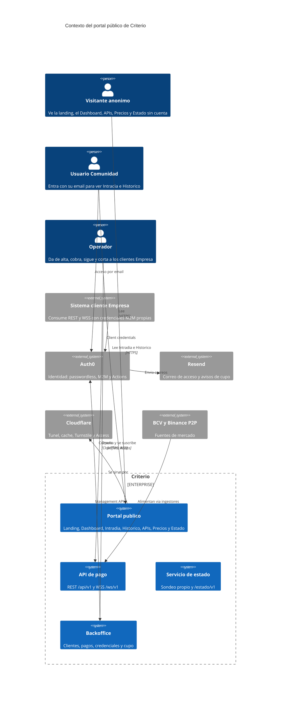
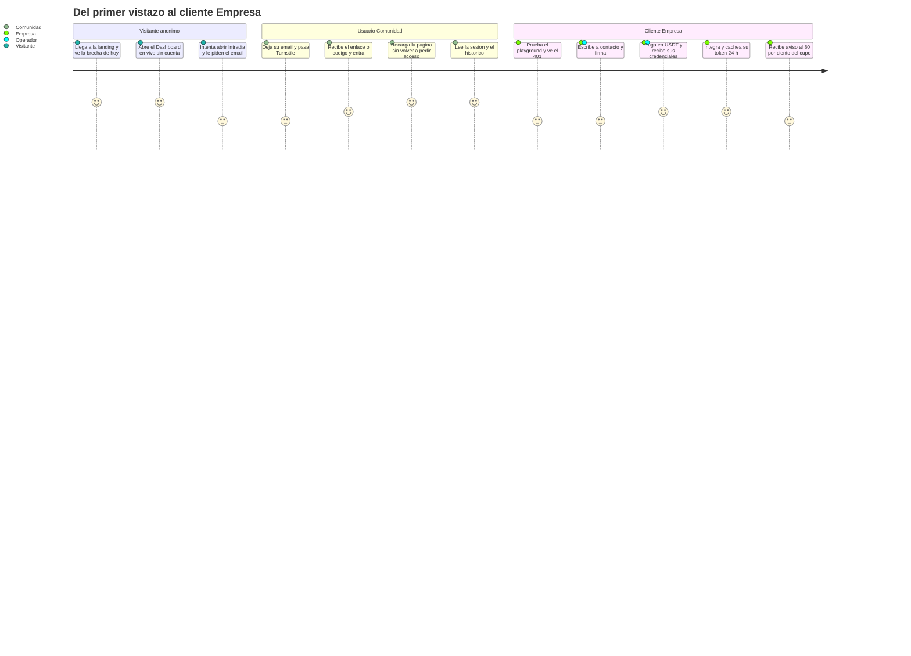
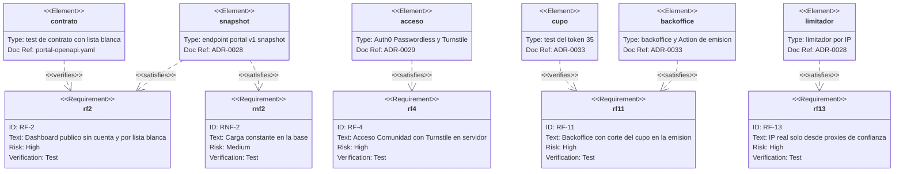

# PRD — Portal público de Criterio

- **Estado:** draft — pendiente de aprobación HITL (Gate 0 incremental)
- **Fecha:** 2026-10-05
- **Decisores:** Jeremi Alcalá
- **Fase AI-DLC:** 01-requirements
- **Versión:** Unreleased (se sincroniza al próximo corte)
- **Gate:** 0 (incremental: el producto pasa de consola con login a sitio público)
- **Feature ID:** portal-publico
- **Nivel ASVS objetivo:** L2

Este PRD fija **qué** tiene que hacer el portal y **cómo se comprueba**.
**Cómo** se construye está en dos sitios, y este documento los referencia sin
duplicarlos:
- el plan por página `portal-publico.md`, con lo que existe, lo que falta y las
  fases;
- las ADR-0028 a ADR-0033, con las decisiones.

Las amenazas están en `docs/02-design/threat-model.md` (T16–T25, ratificadas
HITL el 2026-10-04). El diseño de referencia es el proyecto de Claude Design
«Criterio», archivo `Criterio Público.dc.html`, revisado y alineado con las
decisiones el 2026-10-04.

## Problema y contexto

Criterio mide la brecha cambiaria del bolívar —tasa oficial del BCV contra el
mercado P2P de Binance— y la sirve con procedencia: hora de captura, versión del
motor y porcentaje de outliers en cada lectura. Hoy **todo** está detrás de un
login de Auth0. Las cuentas las crea a mano quien administra el tenant, y el
único endpoint sin token es `/health`.

Eso tiene dos consecuencias:

- **Nadie puede ver el producto antes de tener cuenta.** La lectura del día, que
  es lo que distingue a Criterio de una cotización suelta, no se puede enseñar.
- **La API no tiene cómo venderse.** No hay niveles, ni credenciales por
  cliente, ni cuotas distintas: todos los usuarios tienen 120 peticiones por
  minuto, y no hay manera de dar de alta a un sistema que consume datos sin
  una persona delante.

El portal resuelve las dos: **abre la lectura a cualquiera**, y **convierte la
API en un producto de pago con alta controlada**.

## Objetivos / No-objetivos

**Objetivos**

1. Que cualquiera vea **en vivo y sin cuenta** la lectura del mercado: la
   landing de Producto y el Dashboard.
2. Que quien quiera más contexto (Intradía e Histórico) lo obtenga **solo con
   su email**, sin contraseña ni tarjeta: el **acceso Comunidad**.
3. Que un sistema pueda **contratar la API** (nivel Empresa) y operarla con
   credenciales propias, cuota propia y aviso antes de agotarla.
4. Que el estado del servicio sea **público y honesto**, incluido «no lo sé»
   cuando no hay medición.
5. Que el operador dé de alta, cobre, siga y corte a los clientes **sin tocar
   la consola de Auth0**.

**No-objetivos**

- **Alertas de usuario** («Alertas por API», «Vigilar esta regla»): son un
  producto entero; quedan fuera (D6 del plan).
- **Autoservicio y facturación en línea** del nivel Empresa. El alta es manual,
  tras la firma y el pago en USDT (ADR-0030).
- **Insinuar capacidad predictiva.** Es un no-objetivo heredado del PRD del
  motor. El portal publica qué hizo la brecha después de una señal, **nunca** un
  «N de M» ni una tasa de acierto (contrato `openapi.yaml`).
- **WebSocket para anónimos.** El «en vivo» público es sondeo (ADR-0028 §5); el
  push al segundo es del nivel Empresa.
- **Reescribir la consola interna.** El `web-spa` sigue siendo la consola con
  login (ADR-0031).
- **SSR** y servidor Node para el sitio: basta con prerender estático
  (ADR-0031).

## Contexto del sistema (C4 Context)

*Eje estructura — fase 01 / Gate 0: los cuatro actores del portal y lo que
toca cada uno. El detalle de contenedores y flujos está en el DFD del threat
model (adenda 2026-10-04).*

## Usuarios y escenarios

| Actor | Quién es | Qué necesita | Credencial |
|---|---|---|---|
| **Visitante anónimo** | cualquiera que llega al sitio: analistas, medios, comercios, curiosos | entender qué mide Criterio y ver la lectura de hoy | ninguna |
| **Usuario Comunidad** | quien quiere contexto: qué pasó en la sesión, cómo se compara con el histórico | Intradía e Histórico en el portal | sesión de Auth0 con rol `comunidad` (ADR-0029) |
| **Cliente Empresa** | un **sistema**: fintech, pasarela, tesorería, desarrollador | los datos en su código, por REST y WSS | aplicación M2M propia (ADR-0030) |
| **Operador** | quien administra el producto | alta, cobro, seguimiento y corte de clientes | rol `admin` con MFA, tras Cloudflare Access (ADR-0033) |

### Journey del usuario

*Eje trazabilidad — fase 01 / Gate 0. Los puntos de dolor previstos:*
- *el muro del email en Intradía: hay que explicar qué se gana;*
- *la espera del correo de acceso;*
- *el paso manual de firma y pago;*
- *el aviso de cupo, que a un cliente que integra bien le llega todos los meses
  (ADR-0033 §4).*

### Escenarios positivos

1. **Primera visita.** Un analista abre `/`, ve la brecha de hoy y las cuatro
   promesas con sus paneles en vivo, pulsa «Verlo en el dashboard» y llega al
   Dashboard **sin que nada le pida cuenta**. La edad del dato se ve en la barra.
2. **Acceso Comunidad.** Deja su email en Intradía, pasa Turnstile, recibe el
   correo, entra, y al recargar al día siguiente sigue dentro sin pedir otro
   enlace.
3. **Alta Empresa.** El operador registra al cliente tras el pago y crea sus
   credenciales desde el backoffice. El cliente recibe el secreto por un enlace
   de un solo uso, obtiene su token y consulta `/api/v1` a 200 peticiones por
   minuto.
4. **Mes normal de un cliente Empresa.** Reutiliza su token 24 h, recibe los
   avisos del 80–95 % en la última semana, marcados como «vas al ritmo normal»,
   y el día 1 su cupo se reinicia.
5. **Caída parcial.** Cae el gateway. El Dashboard muestra el último dato con su
   edad y el estado «sin conexión»; la página de Estado sigue respondiendo y
   marca API REST y WebSocket como caídos.

### Escenarios negativos / abuso (requerido por Gate 0)

Cada uno con su amenaza del threat model y el requisito que lo cubre.

| # | Escenario | Amenaza | Lo cubre |
|---|---|---|---|
| A1 | Un raspador sondea el snapshot en bucle, o un flood sin token tumba la base | T16 | RNF-2, RF-3 |
| A2 | Alguien falsifica `CF-Connecting-IP` para tener cuota infinita; o la IP real no llega y todos comparten una cuota | T17 | RF-13 |
| A3 | El snapshot público filtra `merchant_ref` u otro campo Interno | T18 | RF-2 (lista blanca) |
| A4 | Un bot da de alta miles de emails, o usa el formulario para inundar el buzón de un tercero | T19 | RF-4 |
| A5 | Un usuario Comunidad usa su token contra la API de pago | T20 | RF-4 |
| A6 | Un correo falso imita el de acceso para robar la sesión | T21 | RF-4 (DMARC) |
| A7 | El secreto M2M de un cliente se filtra | T22 | RF-10 |
| A8 | Un cliente con un bug pide tokens en bucle y agota los 1.000 del tenant | T23 | RF-11 (corte en la emisión) |
| A9 | Alguien toma el backoffice y emite credenciales de la API de pago | T24 | RF-11 |
| A10 | Alguien manipula el contador de tokens o suplanta la Action | T25 | RF-11 |
| A11 | La página de Estado enseña «operativo» durante una caída que no midió | — (integridad de la comunicación pública) | RF-9 («sin datos») |
| A12 | El portal presenta una regla como «acertada» y un lector la toma como predicción | — (no-objetivo heredado) | RF-2, RF-6 (sin «N de M») |

## Requisitos funcionales

Cada requisito lleva **criterios verificables**: si no se puede comprobar, no
es un requisito.

**RF-1 — Landing de Producto (`/`).**
La portada del sitio (D8). Contiene:
- el hero con la lectura de hoy;
- «Lo que el dato demuestra»: cuatro promesas (Procedencia, Anticipación,
  Contexto y Explicación), cada una con su panel del Dashboard, su endpoint y
  «Verlo en el dashboard»;
- los casos de uso por tipo de cliente y el CTA.

*Verificable:* los paneles salen del mismo snapshot que el Dashboard (una
respuesta, una caché), y el texto estático llega prerenderizado: `curl /`
devuelve contenido, no un `
` vacío.

**RF-2 — Dashboard público (`/dashboard`).**
Sin cuenta. Muestra:
- la lectura de hoy y la brecha buy con su sparkline de 24 h;
- la distancia al disparo y los seis medidores con su escala de 90 días;
- la descomposición de la brecha, el mapa de calor de 14 días × 24 h y la
  referencia P2P de los dos lados;
- la calidad y procedencia del dato, **sin fila de cuota**;
- la **tasa oficial en USD, EUR, CNY, TRY y RUB**;
- la cronología de señales de 30 días, con número de disparos y **efecto
  observado del último**, sin «N de M»;
- la profundidad P2P.

*Verificable:* test de contrato del snapshot con lista blanca
(`additionalProperties: false`); ningún texto del Dashboard contiene un
recuento de aciertos.

**RF-3 — «En vivo» por sondeo.**
El portal pide el snapshot cada 10 s. Deja de pedirlo con la pestaña oculta y
vuelve a pedirlo al hacerse visible. Ante un 429 o un 5xx retrocede y respeta
`Retry-After`. La barra dice «En vivo · actualizado hace N s», con la edad de
`as_of`, no la de la petición.

*Verificable:* los tests de componente de ADR-0028 §5.

**RF-4 — Acceso Comunidad.**
- Alta solo con email, sin contraseña, con Auth0 Passwordless.
- Turnstile **validado en servidor** antes de mandar ningún correo.
- Límites de 3 envíos por hora por email y 10 por hora por IP real.
- Respuesta idéntica haya o no cuenta, y haya o no límite.
- Correo por Resend desde un subdominio con SPF, DKIM y DMARC.
- Rol `comunidad` con `read:portal-comunidad` y nada más.
- Recargar la página no pide otro acceso.

*Verificable:* las pruebas de ADR-0029 §Verificación, incluido un token
Comunidad contra cada ruta de `/api/v1` → 403.

**RF-5 — Intradía (Comunidad).**
- Selector de moneda y de bucket (5 min, 15 min, 1 h);
- lectura de la sesión;
- qué se movió desde la apertura;
- compra contra venta, métrica por métrica;
- microestructura;
- cronología de la sesión;
- «Exportar sesión» (CSV en el cliente).

Sin «Vigilar esta regla».

*Verificable:* sin sesión, la página solo muestra el formulario de acceso y no
pide datos; con sesión, todos los bloques salen de `/portal/v1` con rangos
enumerados.

**RF-6 — Histórico (Comunidad).**
- Lectura del histórico;
- serie con rango 7, 30 o 90 días y bucket seleccionable;
- tasa oficial;
- episodios comparables;
- historial de las reglas con **Casos · Con resultado · Efecto medio ·
  Muestra**, y el vocabulario de `lib/historialReglas.ts` (sin casos,
  hipótesis, indicativa; 6 casos como mínimo).

*Verificable:* ningún rango libre (`from`/`to`) en la petición, y ninguna
columna de aciertos.

**RF-7 — APIs (catálogo y playground).**
- El catálogo se **genera** desde `openapi.yaml` y `asyncapi.yaml` en el build,
  no se escribe a mano: 8 endpoints de datos, `/health` y el WSS con sus 5
  tópicos.
- El playground ejecuta de verdad: `/health` devuelve 200 sin token, y el resto
  el 401 real.

*Verificable:* un cambio de parámetro en `openapi.yaml` cambia el catálogo sin
tocar el portal; CORS admite el origen del portal.

**RF-8 — Precios.**
- Nivel Comunidad gratis y nivel Empresa «Habla con nosotros».
- Tabla comparativa con «8 endpoints de datos» y «5 tópicos».
- Contacto por `mailto:contacto@higerotech.com` y WhatsApp (`wa.me`).

Sin formulario ni backend propio.

**RF-9 — Estado (`/estado`).**
- Estado global.
- Edad del snapshot P2P y de la tasa BCV.
- **Latencia de `/health`**, rotulada así.
- Barras de 60 días para los seis componentes, con **«sin datos» en gris**, que
  no cuenta como disponible.
- Historial de incidentes.

Los datos salen de `/estado/v1`, servido por el servicio de estado y no por el
gateway (ADR-0032).

*Verificable:* con el gateway parado, la página responde y marca API REST como
caída.

**RF-10 — Nivel Empresa.**
- Una aplicación M2M de Auth0 por cliente, con los permisos de los 8 endpoints
  de datos y `stream:events`.
- **200 peticiones por minuto**, que viajan como claim.
- **34 tokens M2M al mes** por cliente.
- El secreto se entrega una sola vez por un canal seguro.
- Guía de alta que exige cachear el token 24 h, también en disco.

*Verificable:* las pruebas de ADR-0030 §Verificación.

**RF-11 — Backoffice.** Interno, tras Cloudflare Access y con rol `admin` con
MFA. Gestiona:
- clientes (estados: pendiente de pago, activo, suspendido, baja);
- pagos en USDT;
- habilitación M2M: crear, suspender, rotar y dar de baja;
- consumo y capacidad;
- auditoría de solo inserción;
- **avisos de cupo al cliente al 80, 85, 90 y 95 %** (tokens 28, 29, 31 y 33);
- **alerta al operador** si el 80 % llega antes de la fecha del ritmo normal;
- **corte en la emisión al 100 %**, en el ciclo del mes calendario.

*Verificable:* las pruebas de ADR-0033 §Verificación.

**RF-12 — Transversal.**
- ES y EN, tema claro y oscuro.
- Pie con contacto y WhatsApp.
- Sin cookies de publicidad ni de seguimiento.
- Aviso de privacidad publicado **antes** de abrir el acceso Comunidad en
  producción (borrador en `docs/legal/`).

**RF-13 — IP real del visitante.**
El gateway y el servicio de estado leen la IP de `CF-Connecting-IP` **solo**
desde `TRUSTED_PROXIES`; fuera de esa lista, la del socket. El limitador por IP
poda sus claves y no escribe IPs en logs ni en la base.

*Verificable:* las pruebas de ADR-0028 §Verificación.

## Requisitos no funcionales

- **RNF-1 — Frescura.** Lo que ve un visitante tiene como mucho **15 s** más que
  el dato (TTL de 5 s + sondeo de 10 s). La edad visible es la de `as_of`.
- **RNF-2 — Carga constante en la base.** El snapshot se calcula como mucho
  **12 veces por minuto**, haya uno o mil visitantes (caché con
  *single-flight*). Las series, una vez por minuto.
- **RNF-3 — Cuota por IP.** **600 peticiones por minuto**: frena a un raspador,
  no a una oficina ni al CGNAT de una operadora móvil.
- **RNF-4 — Indexable.** Producto, Precios, APIs y la carcasa de Estado sirven
  HTML con contenido sin ejecutar JavaScript.
- **RNF-5 — Accesible.** WCAG 2.1 AA en las siete páginas. Cada panel tiene
  estado vacío y degradado explícito; nunca presenta un dato viejo como
  vigente.
- **RNF-6 — Sin secretos en el bundle.** Toda la configuración del portal es
  pública y horneada en el build, como en el `web-spa`.
- **RNF-7 — Una réplica.** La caché y los limitadores viven en memoria. Si el
  gateway escala a más de una réplica, este RNF se revisa (ADR-0028).

## Trazabilidad de requisitos

*Eje trazabilidad — fase 01 / Gate 0: los requisitos de riesgo alto, el
elemento que los satisface y la prueba que los verifica. El resto de los
requisitos remite a la sección «Verificación» de su ADR.*

## Requisitos de seguridad (mapeados a OWASP ASVS)

Con la misma correspondencia de capítulos que el resto de PRDs del repo.

| Req | ASVS | Nivel | OWASP Top 10 |
|---|---|---|---|
| Lectura pública solo por `/portal/v1` y `/estado/v1`, con lista blanca de campos y sin parámetros libres (RF-2, RF-9) | V4, V5 | L2 | A01 |
| IP real solo desde proxies de confianza; limitador con poda (RF-13, RNF-3) | V11, V14 | L2 | A10, A02 |
| Caché con *single-flight* frente al DoS sin autenticar (RNF-2) | V11 | L2 | A10 |
| Acceso Comunidad sin contraseña (Auth0 Passwordless), sesión de primera parte, tokens en memoria (RF-4) | V2, V3 | L2 | A07 |
| Turnstile validado en servidor, límites por email e IP, respuesta uniforme sin enumeración (RF-4) | V2, V11 | L2 | A07, A10 |
| Permisos disjuntos: `read:portal-comunidad` no abre `/api/v1` (RF-4) | V4 | L2 | A01 |
| SPF, DKIM y DMARC en el subdominio de envío (RF-4) | V14 | L1 | A07 |
| Credencial M2M por cliente, entregada una vez y rotable; cuota por claim (RF-10) | V2, V4 | L2 | A07, A01 |
| Corte del cupo M2M en la emisión, con *fail-open* y conciliación (RF-11) | V11 | L2 | A10 |
| Backoffice tras Cloudflare Access + rol `admin` con MFA; Management API con permisos mínimos (RF-11) | V2, V4 | L2 | A01, A07 |
| Auditoría de solo inserción de toda acción administrativa (RF-11) | V16 | L2 | A09 |
| Ningún secreto en el bundle; CSP como en el `web-spa` (RNF-6) | V14 | L1 | A02 |
| Email del usuario solo en Auth0; IPs nunca persistidas (RF-4, RF-13) | V8 | L2 | A02 |

## Threat assessment inicial

**No se repite aquí: está en el threat model.** Duplicarlo haría dos copias del
mismo análisis que divergirían. En `docs/02-design/threat-model.md`, adenda del
2026-10-04:

- **DFD propio del portal**, con los únicos caminos sin token que llegan a la
  plataforma (`/portal/v1`, `/estado/v1` y los estáticos);
- **filas STRIDE** para el portal, `/portal/v1`, el alta Comunidad, los
  clientes M2M, el estado y el backoffice;
- **T16–T25**, con DREAD **ratificado HITL** y el cuadrante actualizado;
- **controles** con la fase del plan que los construye.

Las más altas son **T16** (DoS o raspado sin token, 14), **T19** (abuso del
alta, 13) y **T23** (cupo M2M del tenant agotado, 13). Los escenarios A1–A12 de
arriba remiten a ellas.

## Métricas de éxito

**Técnicas, medibles desde el primer despliegue:**
- Frescura visible ≤ 15 s (p95) en el Dashboard público.
- Cómputos del snapshot ≤ 12 por minuto bajo cualquier tráfico.
- 0 campos fuera de la lista blanca en el snapshot (test de contrato).
- 0 tokens M2M emitidos por encima del cupo de 34 (conciliación con los logs de
  Auth0).
- 0 minutos sin dato pintados como disponibles en Estado.

**De producto, con objetivo pendiente de decisión HITL:**
- Visitantes únicos del Dashboard al mes: **<TODO: objetivo>**.
- Conversión de visitante a acceso Comunidad: **<TODO: objetivo>**.
- Clientes Empresa activos: **<TODO: objetivo>**, con un techo de **29** por el
  plan actual de Auth0 (ADR-0030).
- Tiempo desde el pago hasta las credenciales: **<TODO: objetivo>**.

Medir las de producto exige analítica, y el portal promete no usar cookies de
seguimiento (RF-12). **Cómo se miden sin romper esa promesa** —logs del borde de
Cloudflare, analítica sin cookies, o solo contadores del backend— es una
decisión abierta.

## Dependencias y riesgos

**Dependencias**
- **Auth0:**
  - Passwordless, M2M y Actions;
  - **por confirmar antes del primer cliente:** si el plan ofrece cuota nativa
    de tokens por aplicación, y si los tokens de usuario cuentan contra los
    1.000 M2M del mes.
- **Resend** (correo), **Cloudflare** (túnel, caché del borde, Turnstile y
  Access).
- **Workspace npm** con el paquete de UI compartido (ADR-0031). Es el primer
  paso de la fase 1, y toca el CI, el Dockerfile y el auditor de npm.
- **Aviso de privacidad** revisado (borrador en `docs/legal/`).

**Riesgos**
- **Canibalizar la API de pago** si alguien abre `/api/v1` «para simplificar».
  ADR-0028 lo cierra; cualquier cambio en ese sentido es una ADR nueva.
- **Abuso del alta por email** con nuestro dominio (T19).
- **El margen del cupo M2M es estrecho:** 3–4 tokens al mes para reinicios.
  Los avisos llegan todos los meses a clientes que integran bien, y un mes de
  31 días con tres reinicios corta (ADR-0033 §4).
- **Una sola réplica:** caché y limitadores en memoria (RNF-7).
- **El diseño puede volver a divergir** de los contratos. El catálogo de APIs
  se genera de los YAML (RF-7) precisamente para que no dependa de que alguien
  lo revise.
