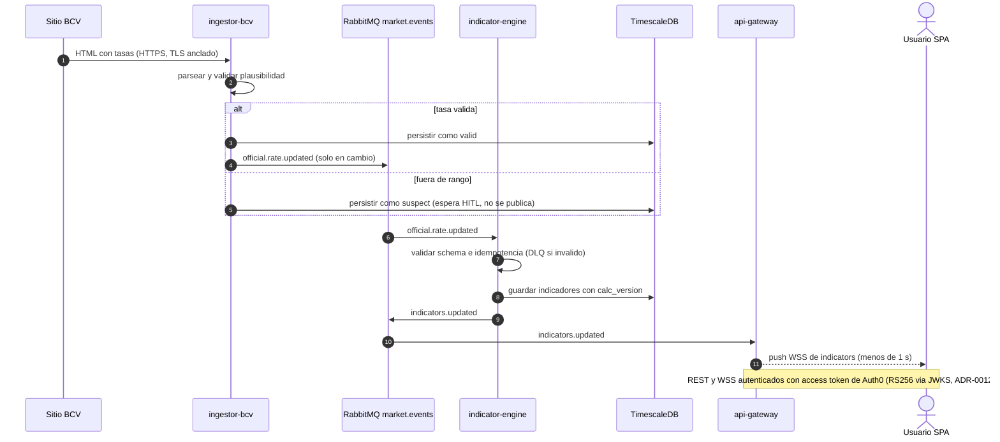
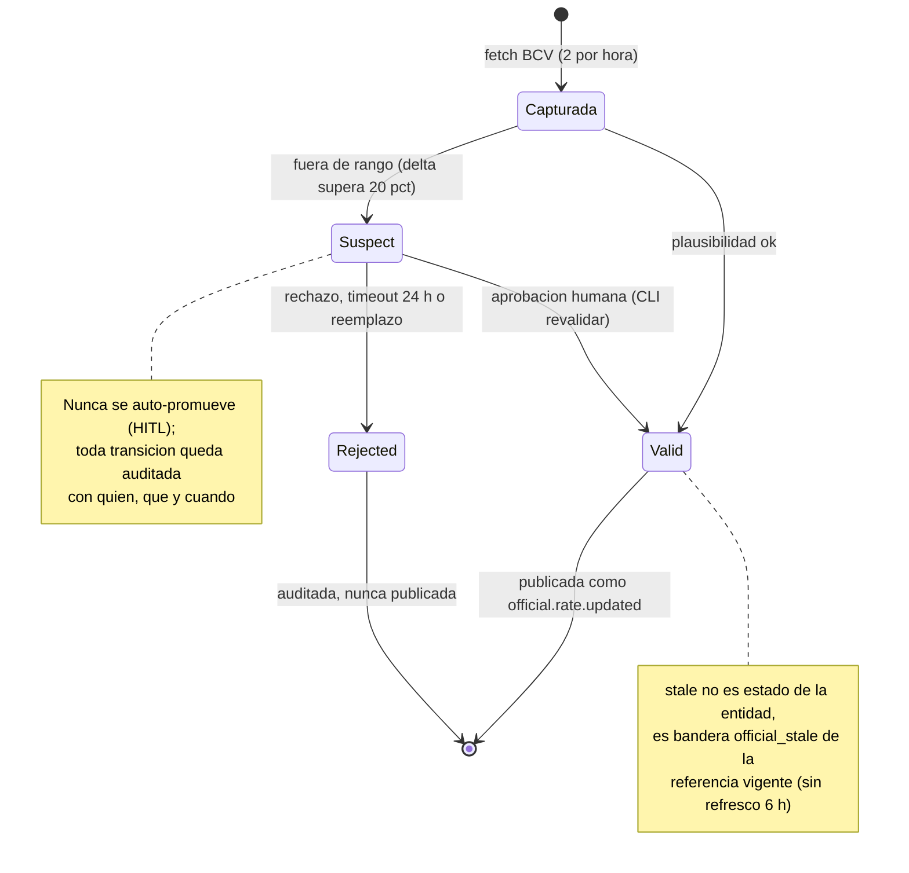
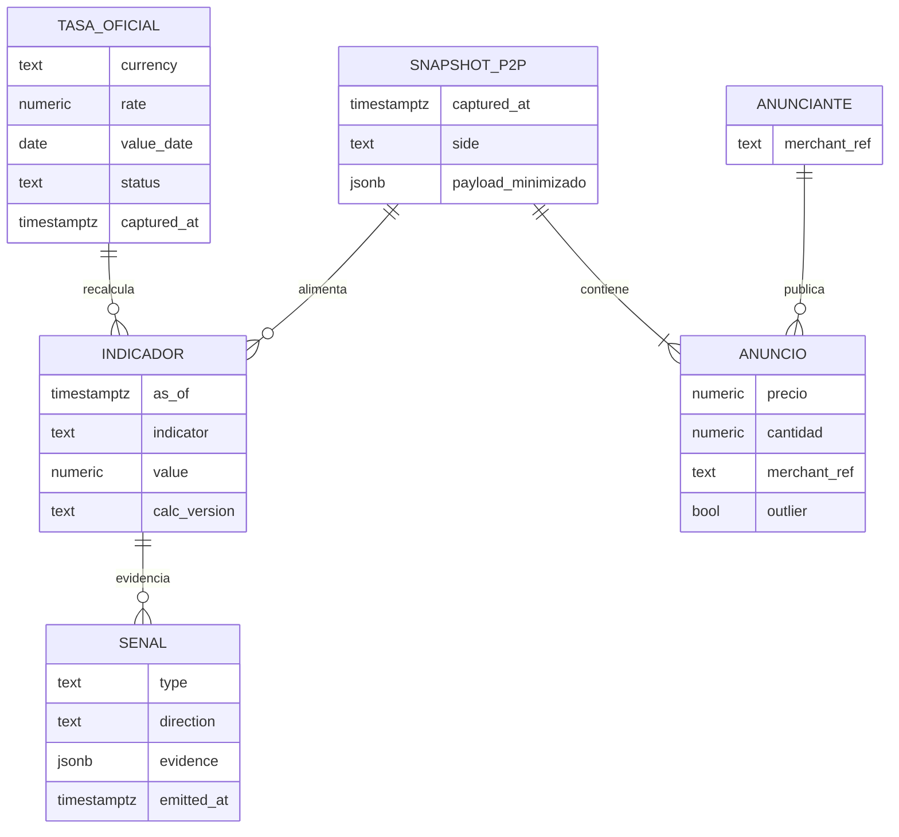
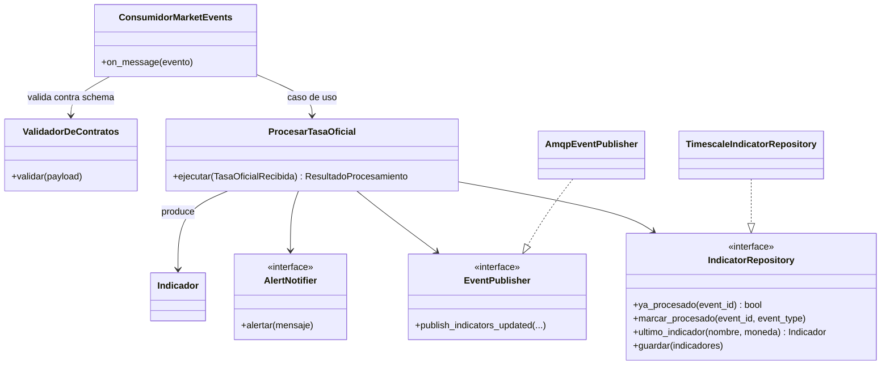

# Diseño del Sistema — VES Market Watch

- **Estado:** approved (Gate 1, HITL 2026-07-11)
- **Fecha:** 2026-07-11
- **Decisores:** Jeremi Alcalá
- **Fase AI-DLC:** 02-design
- **Versión:** 0.2.0

## Estilo arquitectónico
Microservicios ligeros con **Clean Architecture** por servicio: dominio en el centro,
casos de uso, y adaptadores (HTTP, AMQP, DB) en el borde. Regla de dependencia: el dominio
no conoce infraestructura. Comunicación entre servicios **event-driven** vía RabbitMQ
(topic exchange `market.events`); el api-gateway es el único punto de entrada externo.

## Contextos acotados (DDD)
| Bounded Context | Servicio | Responsabilidad | Entidades núcleo |
|---|---|---|---|
| Ingesta P2P | `ingestor-binance` | Capturar y normalizar anuncios P2P | Anuncio, SnapshotP2P, Lado |
| Ingesta Oficial | `ingestor-bcv` | Capturar y validar tasa oficial | TasaOficial |
| Indicadores | `indicator-engine` | Calcular indicadores y señales | Indicador, Señal, PrecioReferencia, Profundidad |
| Acceso | `api-gateway` | Validación de tokens (Resource Server), REST, WSS, rate limiting | Usuario, Suscripción |

## Flujo crítico (secuencia)

*Eje comportamiento — fase 02 / Gate 1: flujo crítico tasa oficial → indicador → push, con la bifurcación HITL de ADR-0007. La ruta P2P (`p2p.snapshot` → engine, fase 2 ya implementada 2026-07-20) sigue el mismo patrón por el bus. El DFD con trust boundaries vive en `threat-model.md`.*

## Ciclo de vida de la entidad núcleo: TasaOficial (ADR-0007)

*Eje comportamiento — fase 02 / Gate 1: máquina de estados implementada en `apps/ingestor-bcv` (migración 002, CLI `revalidar`).*

## Vista C4
Ver `docs/architecture/c4-context.md` y `c4-container.md` (Mermaid, con trust boundaries).

## Contratos de API
Ver `docs/02-design/api-contracts.md` (REST + eventos WSS/AMQP).

## Persistencia (TimescaleDB — ADR-0002)
| Tabla (hypertable) | Contenido | Retención | Estado |
|---|---|---|---|
| `official_rates` | Tasas BCV multi-moneda: valor, fecha-valor, captured_at, status (ADR-0007), auditoría HITL | ≥ 12 meses | ✔ implementada |
| `official_rate_source_health` | Salud de la fuente BCV (fallos consecutivos, stale_since) | vigencia | ✔ implementada |
| `p2p_snapshots_raw` | Snapshot crudo (JSONB, anunciante minimizado) por lado | 90 días (nativa) | ✔ implementada |
| `indicators` | Indicadores calculados con calc_version (formato largo) | ≥ 12 meses | ✔ implementada |
| `processed_events` | Idempotencia del consumidor del engine | vigencia | ✔ implementada |
| `historical_market_snapshots` | Históricos de precio desde exports externos (detalle por banco en JSONB, ADR-0013) | permanente | ✔ implementada |
| `p2p_top_of_book` | Mejor precio/volúmenes por snapshot | ≥ 12 meses | planificada |
| `signals` | Señales emitidas con evidencia | ≥ 12 meses | planificada |

Migraciones por servicio en `apps/<servicio>/db/migrations/` (montadas en el init del
`docker-compose.yml`). Agregados continuos 5 min / 1 h / 1 d para intradía: planificados.
La identidad y las credenciales de usuarios ya no se persisten en la base: viven en Auth0
(ADR-0012); se retiró la tabla `api_clients`.

*Eje estructura — fase 02 / Gate 1: entidades del dominio y sus relaciones. Mapeo físico en la tabla de hypertables de arriba (`TASA_OFICIAL`→`official_rates`, `SNAPSHOT_P2P`/`ANUNCIO`→`p2p_snapshots_raw` JSONB, `INDICADOR`→`indicators`, `SENAL`→`signals` planificada). `ANUNCIANTE` existe solo como pseudónimo `merchant_ref` (ADR-0011) — nunca alias ni ID crudos.*

## Dominio hexagonal (ejemplar: indicator-engine fase 1)

*Eje estructura — fase 02 / Gate 1: regla de dependencia de Clean Architecture visible — el caso de uso depende de puertos (interfaces), los adaptadores los implementan desde el borde. Los otros tres servicios siguen el mismo patrón (ver `apps/<servicio>/docs/design.md`).*

## Patrones de seguridad seleccionados (por amenaza DREAD priorizada)
| Amenaza | Patrón / Control | OWASP |
|---|---|---|
| T1 Tasa oficial falsa (MITM/parse) | TLS anclado + validación de rango + estado `suspect` | A04, A08 |
| T2 Datos P2P manipulados | Filtro outliers (MAD/IQR) + `low_confidence` + supresión de señales | A08 |
| T3 Ataques al login | Auth0 Universal Login + attack protection + MFA; el gateway valida el access token vía JWKS (ADR-0012) | A07, A09 |
| T4 DoS API/WSS | Cuotas por token/IP, límites de conexión WSS, paginación obligatoria | A10 |
| T5 Eventos inválidos en el bus | Schema validation + DLQ + usuarios AMQP con permisos mínimos por servicio | A05, A08, A01 |
| T6 Fuga de secretos | Secret store, rotación, secrets scanning en CI | A02, A04 |
| T7 Baneo por abuso a Binance | Circuit breaker + backoff + presupuesto de requests | A10 |
| T8 Supply chain (deps) | Lockfiles + SCA + imágenes base fijadas por digest | A03 |
