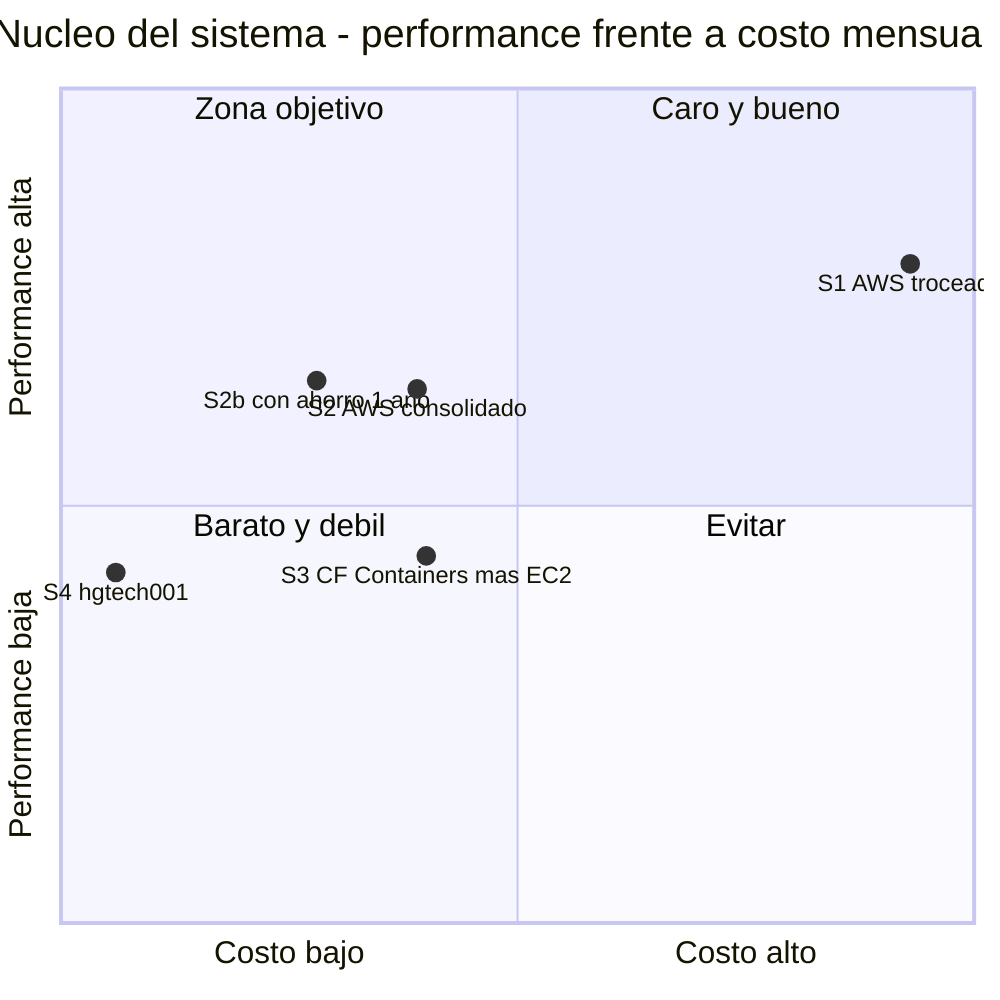

# Placement del despliegue completo — AWS frente a Cloudflare (costo/performance)

- **Estado:** review — análisis para decisión HITL
- **Fecha:** 2026-10-05
- **Decisores:** Jeremi Alcalá
- **Fase AI-DLC:** 02-design
- **Versión:** Unreleased
- **Método:** guía de *deployment placement* del AI-DLC (clasificación por
  perfil, árbol de decisión, matriz PxD con pesos por defecto y precios
  verificados con fecha)

## Resumen

1. **Cloudflare no puede alojar el núcleo del sistema.** Sus Containers no
   tienen disco persistente («all disk is ephemeral by default»), se duermen
   tras 10 minutos sin actividad y siguen en beta. TimescaleDB y RabbitMQ
   necesitan disco que sobreviva a un reinicio. No hay escenario «todo en
   Cloudflare»: el que más se acerca deja la base y el bus fuera, y paga
   latencia y egress por cruzar de proveedor en cada consulta.
2. **Cloudflare sí gana el borde, con mucha diferencia:**
   - el portal, el `web-spa` y la UI del backoffice como estáticos en Workers,
     a $0;
   - DNS, túnel, caché, Access y Turnstile.

   Vale en todos los escenarios.
3. **Para el núcleo, entre las opciones en la nube, gana AWS con una sola
   instancia EC2 `t4g.large`**, que corre el mismo `docker compose` que hoy
   detrás de Cloudflare Tunnel: **$62,76 al mes, o $44,51 con ahorro a un año.**
   Su PxD (0,51, o 0,72 con ahorro) **duplica** el de la arquitectura AWS
   «troceada» (Fargate + Amazon MQ + ALB: $149,53 y PxD 0,26), y supera al
   híbrido con Cloudflare Containers (0,35).
4. **`hgtech001` sigue siendo lo más barato,** pero con el peor puntaje de
   disponibilidad. La decisión de fondo no es AWS o Cloudflare: es **cuándo
   pasa el núcleo de `hgtech001` a AWS**. La recomendación es **antes de vender
   SLA**, es decir, antes del hito M4 (nivel Empresa).

## Carga real (medida el 2026-10-05, no estimada)

En la máquina de desarrollo, que corre el stack completo:

| Servicio | CPU | Memoria | Nota |
|---|---|---|---|
| `timescaledb` | 2,2 % | **4,2 GiB** | la única carga real |
| `rabbitmq` | 0,1 % | 118 MiB | |
| `api-gateway` | 0,2 % | 74 MiB | |
| `ingestor-binance` | ~0 % | 51 MiB | sondea Binance cada 60 s |
| `ingestor-bcv` | ~0 % | 54 MiB | cada 30 min |
| `indicator-engine` | ~0 % | 28 MiB | reactivo al bus |
| `respaldo` | ~0 % | 38 MiB | `pg_dump` diario de ~27 min |

- **Base de datos: 10 GB, y estable.** 9,5 GB son `p2p_snapshots_raw`, con
  retención de 90 días. Sus datos van del 2026-07-06 al 2026-10-05: **la
  ventana ya está llena** y la retención está borrando lo viejo. El full pasó
  de 2,3 GB a 4,9 GB mientras se llenaba, y desde aquí debería estabilizarse en
  torno a 5 GB. Las proyecciones a 12 meses usan **10–15 GB de base**.
- **Egress:** ~5 GB al día de respaldos a B2, unos **150 GB al mes**. Más las
  respuestas de la API, estimadas en 10 GB al mes. En AWS, el egress a internet
  se cobra pasados los primeros 100 GB del mes.

## Clasificación por componente

| Componente | Perfil | Árbol de la guía | Dónde puede vivir |
|---|---|---|---|
| Portal, `web-spa`, UI del backoffice | **A — estático** | Workers static assets | Cloudflare (decidido para el portal el 2026-10-05) |
| `api-gateway` (FastAPI, WSS, AMQP, asyncpg) | **C — API con conexiones persistentes** | ECS Fargate o EC2 | AWS, `hgtech001`, o Cloudflare Containers con reservas |
| `ingestor-binance`, `indicator-engine`, `estado`, `backoffice-api` | **D — worker continuo 24/7** | ECS o EC2 | ídem |
| `ingestor-bcv`, `respaldo` | **D — programado** | tareas bajo demanda | ídem |
| **TimescaleDB** | **E — especial** (extensión con licencia, disco persistente) | ADR dedicada | **EC2, `hgtech001` o Tiger Cloud.** **RDS no ofrece la extensión `timescaledb`**, verificado en la lista oficial de extensiones de RDS para PostgreSQL 16 y 17. **Cloudflare no puede**: sin disco persistente |
| **RabbitMQ** | **D/E** (estado en disco) | Amazon MQ o EC2 | Amazon MQ, EC2 o `hgtech001`. **No en Cloudflare**: Queues no habla AMQP, y adoptarlo es reescribir el bus |

## Escenarios evaluados

En todos, el **borde es Cloudflare**: portal en Workers, túnel, DNS, caché y
Access. Lo que cambia es **dónde vive el núcleo**. Seis servicios siempre
encendidos: los cuatro de hoy más `estado` y `backoffice-api`.

### Costo mensual (us-east-1 para AWS)

| Escenario | Desglose | **USD/mes** |
|---|---|---|
| **S1 — AWS troceado** | Fargate ARM 6 × (0,25 vCPU + 0,5 GB) $43,25; EC2 `t4g.medium` + 50 GB gp3 + IPv4 para la base $32,47; Amazon MQ `t3.micro` $21,74; ALB + 1 LCU $22,27; IPv4 públicas de las tareas $21,90; egress $5,40; CloudWatch $2,50 | **$149,53** |
| **S2 — AWS consolidado** | EC2 `t4g.large` (2 vCPU, 8 GiB) $48,91; 60 GB gp3 $4,80; IPv4 $3,65; egress $5,40. Sin ALB ni NAT: entra por Cloudflare Tunnel | **$62,76** |
| S2b — ídem con ahorro a un año | EC2 a $0,042/h → $30,66 | **$44,51** |
| **S3 — Cloudflare Containers + núcleo en EC2** | Workers Paid $5; 1 contenedor `basic` (gateway) + 5 `lite` $17,76; EC2 `t4g.medium` para base y bus $32,47; egress $8,10 (los consumidores leen el bus desde fuera de AWS) | **$63,33** |
| **S4 — `hgtech001`** | hardware ya pagado; **luz e internet sin medir** | **¿?** (ver sensibilidad) |

**Común a todos y fuera de la comparación:** B2 para los respaldos (~440 GB en
régimen), Cloudflare en plan gratuito para el borde, y GitHub Actions para el
CD.

### Matriz de performance (1–5, pesos por defecto de la guía)

| Criterio (peso) | S1 AWS troceado | S2 AWS consolidado | S3 CF Containers + EC2 | S4 `hgtech001` |
|---|---|---|---|---|
| Latencia (30 %) | 4 — us-east-1 cerca de Venezuela, base en la misma VPC | 4 — ídem, todo en una máquina | **2** — cada consulta del gateway y del motor cruza de Cloudflare a AWS por internet | 3 — buena en local, depende del enlace del ISP |
| Escalabilidad (20 %) | 4 — tareas que escalan; la base, fija | 2 — escalar es cambiar de instancia | 3 — los contenedores escalan; la base, no | 1 — un equipo |
| Cold start / SLA (15 %) | 4 — servicios gestionados, salud por ALB | 3 — una instancia, SLA de instancia de AWS | **2** — Containers en beta, dos proveedores que deben estar arriba | **1** — cortes de luz y del ISP |
| Límites técnicos (15 %) | 5 — corre tal cual | 5 — el mismo compose | **2** — sin disco persistente, sueño por inactividad, conectividad a rehacer | 5 — corre tal cual |
| Carga operativa (20 %) | 3 — muchas piezas, pero gestionadas | 2 — parches de la VM y de Docker | 2 — dos plataformas y la red entre ellas | **1** — hardware, luz, ISP, todo |
| **Score_perf** | **3,95** | **3,20** | **2,20** | **2,20** |
| **Costo** | $149,53 | $62,76 ($44,51) | $63,33 | ¿? |
| **PxD = perf / costo × 10** | **0,26** | **0,51 (0,72)** | **0,35** | ver abajo |

**Sensibilidad de S4:** con un costo real de $10 al mes, PxD = 2,2; con $20,
1,1; con $40, 0,55. **La fórmula premia el costo casi cero, y por eso S4 gana
mientras su costo real sea menor de ~$30 al mes.** Pero la fórmula no pesa lo
que el producto promete. La página de Precios ofrece «SLA y condiciones por
contrato» al nivel Empresa, y **vender un SLA desde el punto con disponibilidad
1 sobre 5** es el riesgo que la matriz no ve.

*Eje trazabilidad, fase 02: costo normalizado sobre $160 al mes y Score_perf
sobre 5. S4 se dibuja con un costo supuesto de $10. La zona objetivo es la de
costo bajo y performance alta. **S2 con ahorro es la que más se le acerca**:
S1 compra performance a más del doble de precio, y S3 cuesta lo mismo que S2
rindiendo menos.*

## Verificación de `hgtech001` (medida el 2026-10-05)

Medido por SSH en la propia máquina: inventario y `sysstat`, que no cargan, más
pruebas breves sobre una base desechable que se creó y se borró en el mismo
comando.

### Máquina

| | |
|---|---|
| Sistema | Ubuntu 24.04.5, kernel 6.8, Docker 29.8 |
| CPU | **Intel Core i3-3240** (2012), 2 núcleos y 4 hilos a 3,4 GHz |
| Memoria | **7,5 GiB** (2,0 en uso por otras cargas, 5,5 disponibles) y 4 GiB de swap |
| Disco | **un HDD mecánico de portátil de 500 GB** (`ST500LT012`), 408 GB libres. Sin `smartctl` instalado: su salud no está verificada |
| Comparte con | Bragi (Jellyfin, 1,1 GiB), el stack de monitoreo Yggdrasil (Prometheus, Grafana, Alertmanager, Node-RED, Mosquitto), Transmission, túneles |
| **Ya corre** | **un despliegue parcial de Criterio del 2026-09-07** en `/srv/infra/ves-market`: TimescaleDB con 102 MiB, prácticamente vacía; RabbitMQ; y el gateway `sha-d12a351`. Sin ingestores ni motor |

### Performance: suficiente, y con holgura

| Prueba | `hgtech001` | Desarrollo (referencia) | Carga real de Criterio |
|---|---|---|---|
| `pgbench` (escala 20, 4 clientes, 60 s, lectura y escritura) | **148 TPS**, 27 ms | 1.740 TPS, 2,3 ms | **2,9 transacciones/s** (medido en 60 s sobre la base de desarrollo) |
| Disco secuencial, directo | 94 MB/s escritura, 99 MB/s lectura | — | `pg_dump` de ~10 GB y full de ~5 GB al día |
| Subida | **~182 Mbps** | — | ~5 GB al día a B2, más servir la API |
| Bajada | 1,2 Mbps (**anómalo**; Transmission estaba activo, hay que repetir la medida con él en pausa) | — | poca: Binance y BCV |
| Latencia a Cloudflare (1.1.1.1) | 35 ms | — | |
| CPU histórica (`sysstat`, 7 días) | 89–94 % libre, iowait diario de 0,6 % | — | |

**El disco mecánico es 12 veces más lento que el de desarrollo, pero la carga
de Criterio usa el 2 % de lo que da:** unas 50 veces de holgura. La memoria
alcanza: la base en desarrollo usa 4,2 GiB, casi todo caché, y en
`hgtech001` quedan 5,5 GiB disponibles. Lo que sí será lento es la
verificación semanal, que restaura un full entero en el mismo disco: hay que
medirla allí, sin dar por buenos los 28 minutos de desarrollo.

### Disponibilidad: el problema real

- **Apagados abruptos.** **10 arranques en 19 días** (del 2026-09-16 al
  10-05) y **solo 3 apagados ordenados** registrados por `last -x`, así que
  unos 7 fueron cortes. En cinco de esos arranques, el reloj de arranque está
  en **2026-07-28 15:04:49**. Ese patrón aparece cuando la máquina arranca en
  frío con el reloj de la BIOS reseteado: típicamente tras perder la corriente
  del todo, con la pila CMOS agotada.
- **Sin UPS.** No hay servicio de UPS (NUT o apcupsd) que apague la máquina con
  orden.
- **El 09-28** coincide con dos arranques en frío y con un **iowait medio del
  28,8 %** ese día.
- **El reloj se corrige por NTP al arrancar**
  (`Initial clock synchronization`). Pero los contenedores arrancan solos
  (`unless-stopped`), así que puede haber unos segundos en los que un ingestor
  escriba con fecha de julio, o el gateway rechace tokens por `exp`.

### Veredicto

**Factible en performance. No recomendable como producción con SLA en su
estado actual.** El cuello no es la CPU ni el disco: es la energía. Encaja con
la puntuación de 1 sobre 5 en disponibilidad que la matriz le dio a S4 sin
medir.

**Condiciones para usarla en M1–M3** (sin SLA), en orden de impacto:

1. **UPS con NUT** que apague la máquina con orden antes de agotarse. Es lo que
   convierte un corte de luz en un reinicio limpio.
2. **Cambiar la pila CMOS** (CR2032) para que el reloj no vuelva a julio.
3. **Que Docker arranque después de la sincronización de hora**:
   `systemd-time-wait-sync` y `After=time-sync.target` en `docker.service`.
4. **SMART del disco** (`smartmontools`). Si hay sectores reasignados o
   pendientes, cambiarlo por un **SSD**, que de paso multiplica el TPS por
   diez.
5. **Medir la verificación semanal allí** y limitar el ancho de banda de
   Transmission, o sacarlo, para que no compita con la subida de los
   respaldos.
6. **Decidir qué hacer con el despliegue parcial del 2026-09-07:** reemplazarlo
   por el de la fase 9, o borrarlo.

Con esto, `hgtech001` es una base razonable para M1–M3. **Para M4, que vende
SLA, la recomendación de AWS se mantiene:** una UPS mejora el apagado, pero no
la disponibilidad de la red eléctrica ni la del enlace de una casa.

## Por qué no «todo en Cloudflare»

No es una preferencia: son límites de la plataforma, verificados en su
documentación el 2026-10-05.

- **Disco efímero.** «All disk is ephemeral by default. When a Container
  instance goes to sleep, the next time it starts, it uses a fresh disk.»
  Persistir exige snapshots o montar R2 por FUSE: inaceptable para una base de
  datos.
- **Sueño por inactividad:** `sleepAfter` es de 10 minutos por defecto. Los
  servicios 24/7 (consumidores del bus, ingestores) tienen que forzarse a no
  dormir, y pagan memoria aprovisionada todo el mes.
- **Sin AMQP gestionado.** Queues es otra semántica: adoptarla es reescribir
  ingestores, motor y gateway.
- **Sin Postgres gestionado propio.** Hyperdrive acelera consultas **desde
  Workers** hacia una base que vive en otro sitio. No la aloja.
- **El híbrido paga dos veces:** latencia entre proveedores en cada consulta, y
  egress de AWS por cada evento que los consumidores leen del bus.

## Recomendación

1. **Borde en Cloudflare, ya decidido y confirmado por PxD.** Portal, `web-spa`
   y UI del backoffice como estáticos en Workers, a $0 (las peticiones a
   estáticos son gratis e ilimitadas). Túnel, caché del borde, Access y
   Turnstile. Va en la ADR-0034 (fase 0.1 del plan).
2. **Núcleo en AWS con una sola EC2 `t4g.large`** (S2), corriendo el mismo
   `docker compose` detrás de Cloudflare Tunnel. Sin ALB, sin NAT y sin puertos
   abiertos.
   - **Costo:** $62,76 al mes, y **$44,51 con ahorro a un año** una vez estable.
   - **Por qué gana:** es el mejor PxD en la nube, cambia lo mínimo del sistema,
     y deja el SLA en manos de AWS y no de la red eléctrica.
3. **`hgtech001` como paso intermedio, solo si se acepta su disponibilidad:**
   vale para M1–M3, que no tienen SLA, y no para M4. Si se usa, conviene **medir
   su costo real** (luz, internet y amortización) para cerrar la sensibilidad
   de arriba.
4. **Reconsiderar S1 (troceado)** solo si el tráfico se multiplica por 10 y una
   sola instancia deja de bastar. Hoy compra escalabilidad que nadie usa, al
   doble de precio.
5. **CD:** GitHub Actions para todo. Los destinos son mixtos (Workers y EC2), y
   así lo pide la guía.

## Decisión que se pide (HITL)

| # | Pregunta | Opciones |
|---|---|---|
| D15 | **¿Dónde vive el núcleo en producción?** | (a) AWS EC2 `t4g.large` desde el principio (recomendado); (b) `hgtech001` para M1–M3 y migración a AWS antes de M4; (c) `hgtech001` sin fecha de migración |

La respuesta reescribe la **ADR-0035** (puesta en producción, fase 0.2 del
plan) y la fase 9: dónde se restaura el full de arranque y dónde corre el CD.

## Condiciones de revisión

- **El tráfico de la API se multiplica por 10,** o hay más de 29 clientes
  Empresa: revisar S1.
- **Cloudflare Containers sale de beta con volúmenes persistentes:** revisar
  S3, porque el límite que lo descarta es técnico.
- **Cambian los precios:** la guía da los suyos por caducados a los 6 meses.
  Estos caducan el **2027-04-05**.
- **La base pasa de 50 GB:** revisar el disco y la instancia de S2.

## Fuentes (consultadas el 2026-10-05)

- **AWS Price List API** (oficial, us-east-1):
  - `AmazonECS`, publicación del 2026-09-11. Fargate ARM: $0,03238 por
    vCPU-hora y $0,00356 por GB-hora. x86: $0,04048 y $0,004445.
  - `AmazonMQ`, 2026-09-11. RabbitMQ `t3.micro` single-AZ: $0,02704 por hora;
    almacenamiento a $0,10 por GB-mes.
  - `AWSELB`, 2026-09-11. ALB: $0,0225 por hora y $0,008 por LCU-hora.
  - `AWSDataTransfer`, 2026-09-16. Salida a internet: $0,09 por GB en los
    primeros 10 TB, pasado el free tier global de 100 GB.
- **AWS VPC pricing** (aws.amazon.com/vpc/pricing): NAT a $0,045 por hora y
  $0,045 por GB; IPv4 pública a $0,005 por hora.
- **AWS EBS pricing** (aws.amazon.com/ebs/pricing): gp3 a $0,08 por GB-mes,
  según el ejemplo de la propia página. La tabla regional no se pudo extraer.
- **EC2** (instances.vantage.sh, actualizado el 2026-10-05):
  - `t4g.medium`: $0,034 por hora, o $0,021 con reserva a un año sin pago
    inicial;
  - `t4g.large`: $0,067 por hora, o $0,042.

  El archivo oficial de EC2 pesa varios GB; se usó el agregador citado.
- **Extensiones de RDS para PostgreSQL** (docs.aws.amazon.com,
  PostgreSQLReleaseNotes/postgresql-extensions): **`timescaledb` no aparece**
  en las versiones 16 ni 17; `pg_partman` sí.
- **Cloudflare Containers**, pricing:
  - $0,00002 por vCPU-s, $0,0000025 por GiB-s y $0,00000007 por GB-s;
  - con Workers Paid se incluyen 25 GiB-h, 375 vCPU-min y 200 GB-h;
  - egress en Norteamérica a $0,025 por GB, con 1 TB incluido.

  Changelog del 2025-11-21: **la CPU se factura por uso activo**, y la memoria
  y el disco por lo aprovisionado.
- **Cloudflare Containers**, FAQ: disco efímero por defecto, `sleepAfter` de
  10 minutos, sin volúmenes persistentes nativos. El documento técnico aún
  titula «Containers (Beta)».
- **Cloudflare Workers**, pricing:
  - $5 al mes con 10 M de peticiones;
  - **estáticos gratis e ilimitados**;
  - Durable Objects y Queues según su tabla;
  - Hyperdrive sin cargo por consulta.
- **Cloudflare R2**, pricing: $0,015 por GB-mes y **egress gratis**. No se usa
  hoy: los respaldos siguen en B2.
- **Tiger Cloud (Timescale)**, tigerdata.com/pricing: Performance «desde $30 al
  mes» y Scale «desde $36». La página no publica el precio por GB, así que **no
  entra en la comparación** sin cotización. Con 10–15 GB de base, una EC2
  propia sale más barata.
