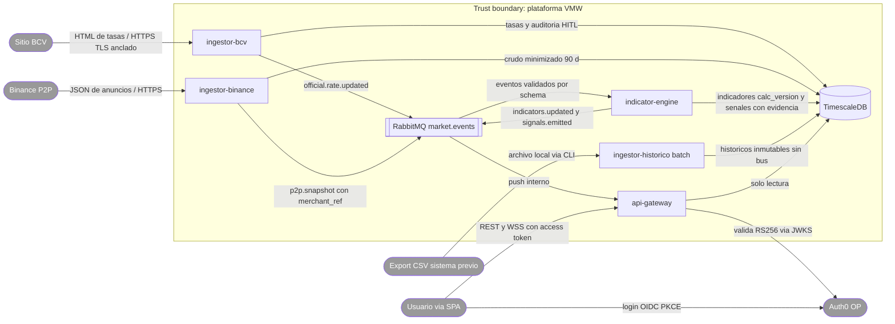
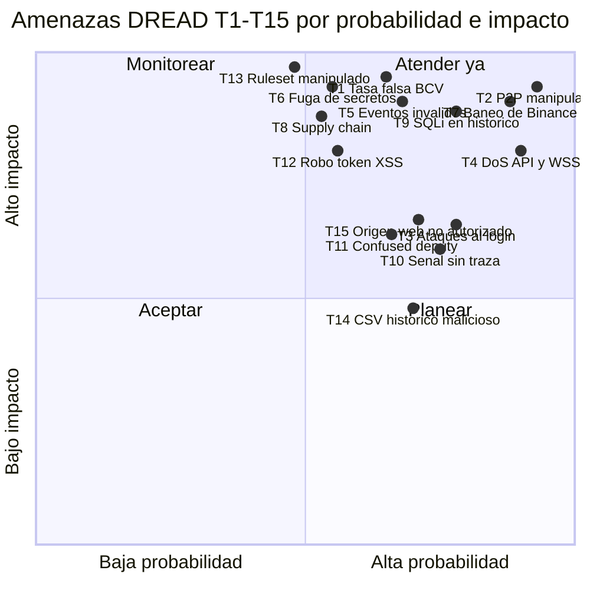

# Threat Model — Criterio (sistema completo)

- **Estado:** approved (Gate 1, HITL 2026-07-11)
- **Fecha:** 2026-07-26
- **Decisores:** Jeremi Alcalá
- **Fase AI-DLC:** 02-design
- **Versión:** 0.4.1
- **Alcance:** sistema completo (5 servicios + web-spa + RabbitMQ + TimescaleDB)
- **Metodología:** STRIDE + DREAD
- **Clasificación de datos:** ver `docs/00-project/data-classification.md`

> Adenda 2026-07-26 (post-aprobación, sin cambio del veredicto del Gate 1): alcance
> ampliado al quinto servicio `ingestor-historico` (ADR-0013) y al ruleset del motor de
> señales (ADR-0015) — fila STRIDE y amenazas **T13–T14** añadidas. Puntuación DREAD
> de T13–T14 **ratificada HITL 2026-07-26** (Jeremi Alcalá).

> Adenda 2026-07-27 (post-aprobación, ADR-0017): el front-end **`web-spa`** entra al
> alcance del repo — **T12 pasa de control externo a implementación verificada aquí**
> (tokens en memoria + rotation + CSP), y se añade **T15** (origen web no autorizado)
> mitigada por la allowlist CORS del gateway. Puntuación DREAD de T15 **ratificada
> HITL 2026-08-04** (Jeremi Alcalá) — ver la adenda de abajo.

> Adenda 2026-08-04 (ratificación de T15, sin cambio del veredicto del Gate 1): la
> puntuación 2/2/2/2/2 = **10** se ratifica tras verificarla contra el código y no
> contra la ficha. El gateway expone **14 endpoints, todos `GET`**, con
> `allow_methods=["GET"]`, `allow_headers=["Authorization"]` y **sin
> `allow_credentials`** (defecto `False`); el WSS exige el access token en la query
> porque el navegador no puede fijar `Authorization` en el handshake.
>
> **La ficha atribuía la mitigación a CORS, y CORS es la segunda línea.** La primera
> es que **no hay autoridad ambiental que secuestrar**: cada endpoint pide un bearer,
> no hay cookie de sesión hacia la API y el token vive en memoria del contexto JS del
> propio SPA (T12), inalcanzable desde otro origen. Una página ajena no falla al
> *leer* la respuesta: falla al *autenticarse*. Por eso validar `Origin` en el
> handshake WSS es defensa en profundidad y no un hueco — sin token no hay handshake
> que validar.
>
> **Lo que dispararía revisar esta puntuación es un cambio del modelo de
> autenticación**: si la API pasara a aceptar cookies, un origen ajeno ganaría
> autoridad ambiental y T15 subiría de golpe. No es hipotético — ADR-0020 dejó una
> cookie SSO de primera parte *hacia Auth0*, y extender ese patrón *hacia la API* es
> la misma clase de presión que T12 documenta con `localStorage`.
>
> Reserva honesta sobre un factor: **Discoverability se ratifica en 2, pero es el más
> débil de los cinco.** La política CORS se revela con un solo
> `curl -H "Origin: https://evil.com"`, lo que argumenta un 3 (score 11). Se mantiene
> en 2 por consistencia con T11 —confused deputy, misma clase de control de
> configuración— y porque 10 u 11 caen en la misma banda de prioridad y no cambian el
> tratamiento. Queda escrito para que la próxima recalibración lo mire.

## Diagrama de flujo de datos

*Eje comportamiento — fase 02 / Gate 1: DFD con trust boundaries que alimenta el STRIDE de abajo. Los actores grises son externos (no confiables o fuera de nuestro control). Estructura complementaria en `docs/architecture/c4-container.md`.*

## Análisis STRIDE
| Componente | Spoofing | Tampering | Repudiation | Info Disclosure | DoS | Elevation |
|---|---|---|---|---|---|---|
| ingestor-binance | Endpoint P2P suplantado (MITM) | Anuncios manipulados / respuesta alterada | Sin registro de snapshots capturados | — (datos públicos) | Baneo/429 de Binance; payloads gigantes | — |
| ingestor-bcv | Dominio BCV suplantado (DNS/MITM) | Tasa falsa inyectada; HTML alterado | Sin auditoría de tasas capturadas | — | Caída del sitio BCV; parser roto | — |
| RabbitMQ | Servicio se conecta con credencial ajena | Eventos inválidos/malformados publicados | Publicaciones sin trazabilidad | Credenciales AMQP filtradas | Tormenta de eventos; colas llenas | Usuario AMQP con permisos excesivos |
| indicator-engine | — | Datos envenenados → señales falsas; duplicados/reorden; ruleset de señales alterado (T13) | Señal sin evidencia de inputs | — | Backlog de eventos | — |
| ingestor-historico | — (entrada por archivo local, sin red) | Export CSV malicioso/alterado envenena el histórico (T14) | Cargas sin registro de archivo/fecha | — (datos públicos agregados) | CSV gigante/corrupto rompe la carga | — |
| web-spa (browser) | Sitio falso imita el dashboard (phishing hacia el login real) | Dependencia npm comprometida inyecta código en el bundle (T8) | — | Robo de token vía XSS (T12); origen ajeno lee la API (T15) | — | Scopes acotados por el RBAC del token (no hay elevación local) |
| api-gateway | Tokens falsificados; ID token / token de otra audiencia usado como bearer | Manipulación de parámetros de consulta | Accesos sin log | Errores verbosos; PII de usuario en logs | Flood REST/WSS; scraping histórico | Usuario accede a scopes/permisos ajenos |
| Auth0 (OP externo) | Ataques al login (credential stuffing, breached passwords); phishing de callback | Config del tenant alterada (audiencia, `redirect_uri`) | — | Enumeración de usuarios en login | Abuso del endpoint de login | Roles/permisos mal asignados en RBAC |
| TimescaleDB | Conexión con rol ajeno | SQL injection vía parámetros | Cambios sin auditoría | Dump de credenciales de clientes | Consultas de histórico sin límites | Rol de servicio con privilegios amplios |

## Amenazas priorizadas (DREAD)
Escala 1–3 por factor (Damage, Reproducibility, Exploitability, Affected users, Discoverability). Score = suma.

| ID | Amenaza | D | R | E | A | D | Score | Control / ADR |
|---|---|---|---|---|---|---|---|---|
| T1 | Tasa oficial falsa entra al sistema (MITM/parse erróneo del BCV) | 3 | 2 | 2 | 3 | 2 | 12 | TLS anclado + validación de rango + estado `suspect` — ADR-0006, A04/A08 |
| T2 | Anuncios P2P manipulados distorsionan indicadores y señales | 3 | 3 | 3 | 3 | 3 | 15 | Filtro outliers MAD/IQR, mediana/VWAP top-N, `low_confidence` — A08; recurrencia de manipuladores rastreable vía `merchant_ref` — ADR-0011 |
| T3 | Ataques al login (credential stuffing, fuerza bruta, breached passwords) | 2 | 2 | 2 | 2 | 3 | 11 | Login en Auth0 con attack protection (brute-force, bot detection, breached-password) + MFA; el gateway ya no expone /auth/token — ADR-0012, A07 |
| T4 | DoS sobre API/WSS (flood, scraping de histórico) | 2 | 3 | 3 | 3 | 3 | 14 | Cuotas por token/IP, límites WSS, paginación y rangos máximos — A10 |
| T5 | Eventos malformados/inyectados en el bus rompen el engine | 3 | 2 | 2 | 3 | 2 | 12 | Schema validation + DLQ + usuarios AMQP mínimos — ADR-0004, A05/A01 |
| T6 | Fuga de secretos (credenciales DB/AMQP, clave HMAC de anunciantes) | 3 | 1 | 2 | 3 | 2 | 11 | Secret store + rotación ≤ 90 d + secrets scanning CI — A02/A04. Las claves de firma JWT ya no son activo propio (gestionadas por Auth0 — ADR-0012) |
| T7 | Baneo de IP por Binance por polling agresivo | 3 | 2 | 3 | 3 | 3 | 14 | Circuit breaker + backoff + presupuesto de requests — ADR-0005, A10 |
| T8-fuentes | Fuente web de terceros inyectada desde un CDN | — | — | — | — | — | — | Evitado por diseño (2026-07-31, ADR-0018): Inter y Space Grotesk se **autoalojan** en el bundle; la CSP del nginx sigue en `default-src 'self'` y no se abre a ningún CDN |
| T8 | Compromiso de dependencia (supply chain) en cualquier servicio | 3 | 1 | 2 | 3 | 2 | 11 | Lockfiles + SCA en CI + imágenes por digest — A03 |
| T9 | SQL injection vía parámetros de histórico en gateway | 3 | 2 | 2 | 3 | 3 | 13 | Queries parametrizadas + validación estricta de inputs — A05 |
| T10 | Señales sin trazabilidad (repudio/no reproducibles) | 2 | 3 | 2 | 2 | 2 | 11 | Evidencia de inputs + regla versionada `<type>@v<n>` + `calc_version` + logging estructurado — ADR-0015, A09; forense de anunciantes entre snapshots vía `merchant_ref` — ADR-0011 |
| T11 | ID token o token de otra audiencia/tenant usado como bearer (confused deputy) | 2 | 2 | 2 | 2 | 2 | 10 | Validación estricta de `aud` (=API), `iss` (=tenant) y firma JWKS; solo se acepta el access token — ADR-0012, A01/A07 |
| T12 | Robo de token en el navegador (XSS) del front-end/SPA | 3 | 1 | 2 | 2 | 2 | 10 | Token en memoria (nunca localStorage), access token de vida corta, refresh con rotación — **implementado en `apps/web-spa`** (`cacheLocation: memory`, rotation, CSP del nginx sin unsafe-inline) — ADR-0012/ADR-0017, A03/A07. **Reforzado 2026-08-01 (ADR-0020)**: con dominio propio la cookie SSO es de PRIMERA parte, así que la sesión persiste sin guardar nada en el navegador — desaparece la presión de relajar `cacheLocation` a `localstorage` para ganar comodidad, que era el riesgo real que acechaba a este control |
| T13 | Ruleset de señales manipulado (YAML) → señales arbitrarias a consumidores | 3 | 3 | 1 | 3 | 1 | 11 | Ruleset versionado en repo (cambio = commit auditable), carga estricta al arranque (mal formado ⇒ aborta), no editable en runtime, regla `<type>@v<n>` en la evidencia — ADR-0015, A02/A08, ASVS V14 |
| T14 | Export CSV malicioso envenena el histórico (varianza/backtests sesgados) | 2 | 2 | 2 | 1 | 2 | 9 | Parseo adaptativo con rechazo completo sin columna de precio y descarte contado por fila; histórico inmutable e idempotente (PK + ON CONFLICT DO NOTHING); sin publicación al bus (no dispara el pipeline reactivo) — ADR-0013, A05/A08 |
| T15 | Página web de un origen no autorizado consume la API desde el browser de un usuario | 2 | 2 | 2 | 2 | 2 | 10 | **Primera línea: no hay autoridad ambiental.** Todo endpoint pide bearer; sin cookie hacia la API (`allow_credentials` no se activa) y con el token solo en memoria del SPA (T12), un origen ajeno no puede autenticarse. **Segunda línea:** CORS por allowlist (`ALLOWED_ORIGINS`, `allow_methods=["GET"]`) — ADR-0017, A01/A05. El WSS queda fuera de CORS por diseño del browser, pero exige el token en la query (mitiga CSWSH); validar `Origin` en el handshake es hardening en profundidad, no un hueco. **Ratificada HITL 2026-08-04** |

*Eje trazabilidad — fase 02 / Gate 1: probabilidad ≈ (R+E+D)/9, impacto ≈ (D+A)/6 de la tabla DREAD, con separación mínima para legibilidad. La tabla es la fuente de verdad; el cuadrante es la vista de priorización.*

## Controles y trazabilidad
| Amenaza | Control | Verificación (fase 04-testing) |
|---|---|---|
| T1 | ADR-0006; validación de rango en PRD ingesta-bcv RF-3 | ✔ Cubierto (2026-08-04): `unit/test_parser_html_alterado.py` del `ingestor-bcv`, marcador `security` — bloque mutilado, código no ISO 4217, valor no numérico, moneda duplicada en el camino degradado por regex y fecha-valor corrupta (incluida `2026-13-45`, que pasa el patrón y no existe). La regla que fijan: ante un dato dudoso, ninguno. Tasa fuera de rango, en `unit/test_validation.py` + `sync_rates` |
| T2 | PRD motor-indicadores escenario negativo 1; ADR-0011 | Etiquetado MAD verificado en ingestor-binance (unit tests + dato real); filtrado final y supresión `confianza_baja` verificados en el engine (fase 2 implementada 2026-07-20, unit/contract) |
| T3 | ADR-0012; PRD api-streaming escenario 2; attack protection del tenant Auth0 | Verificación de config del tenant (brute-force, breached-password, MFA); revisión de logs de seguridad |
| T4 | PRD api-streaming RF-4; ADR-0016 (rate limit, límites WSS) | Rate limit (429/`Retry-After`), rango ≤ 90 días (422) y límites WSS (1008) cubiertos por la suite del gateway (2026-07-26); pendiente test de carga y fuzzing de paginación |
| T5 | ADR-0004; PRD motor-indicadores escenario 4 | Test contract de eventos + inyección de evento inválido → DLQ |
| T6 | Política de secretos (data-classification) | ✔ Cubierto en CI (2026-08-04): `gitleaks` sobre la **historia completa** en `seguridad.yml`, rompiendo el build; excepciones una a una y con motivo en `.gitleaks.toml` (dos, ambas comprobadas como públicas). Pendiente: revisión de rotación, que llega con el secret store de fase 05 |
| T7 | ADR-0005 | ✔ Cubierto (2026-08-04): `integration/test_client_errores.py` del `ingestor-binance`, marcador `security` — un 429 **real por HTTP** contra servidor local llega hasta el contador del breaker, y una vez abierto el ciclo siguiente **ni siquiera consulta**. Antes solo estaba la mecánica del breaker contra una operación falsa |
| T8 | Pipeline CI (Gate 2) | Parcial (2026-08-04): `pip-audit` por servicio y `npm audit --audit-level=high` en `seguridad.yml`, rompiendo el build, más pasada semanal. **Falta lo que hace reproducible el SCA**: no hay lockfiles en los cinco servicios Python ni imágenes fijadas por digest, así que se audita lo que se instaló en esa ejecución. El control promete las tres cosas y solo está la del medio |
| T9 | PRD api-streaming escenario 6; ADR-0016 (pool read-only) | Queries parametrizadas + pool `default_transaction_read_only` verificado (INSERT rechazado, integration del gateway 2026-07-26); SAST cubierto desde 2026-08-04: CodeQL (`security-and-quality`) para Python y TypeScript, con un paso que lee el SARIF y **falla ante nivel `error`** — CodeQL por sí solo solo deja una alerta |
| T10 | PRD motor-indicadores RF-3; ADR-0015 (evidencia `rule` + `inputs`) | Auditoría de una señal end-to-end (verificada e2e 2026-07-22: snapshot → `correccion_inminente` en bus y tabla con evidencia) |
| T11 | ADR-0012; PRD api-streaming escenario 3 | ✔ Cubierto: rechazo de ID token (aud ajena), `iss` ajeno, alg ≠ RS256 y kid desconocido → 401 genérico (unit del gateway, 2026-07-26) |
| T12 | ADR-0012; ADR-0017 (`apps/web-spa`) | ✔ Cubierto: `cacheLocation: memory` + rotation en `AuthProvider` (revisado; guard con tests); checklist e2e verifica en DevTools que no hay tokens en storage; CSP del nginx. **Corregido 2026-07-31**: se añadió `frame-src` del tenant (sin él la re-autenticación silenciosa por iframe se bloqueaba y cada recarga acababa en Universal Login visible). Al verificarlo apareció algo mayor: por la herencia de `add_header` de nginx —un `location` con cabeceras propias descarta las del `server`— **el sitio se servía sin CSP, sin nosniff y sin Referrer-Policy en TODAS las respuestas**. Las cabeceras viven ahora en un fragmento incluido en cada location; comprobado en el contenedor (`example.com` bloqueado por `frame-src`, el tenant permitido) y vigilado por `tests/unit/csp.test.ts`. **Corregido 2026-08-01**: faltaba `worker-src 'self' blob:`. Con `useRefreshTokens` + caché en memoria, `auth0-spa-js` canjea el código en un Web Worker creado desde un `blob:`; sin la directiva cae en `default-src 'self'`, el worker **construye pero muere al cargar** —sin excepción, sin log y sin petición de red— y **el login se colgaba por completo**. Lo introdujo el propio arreglo del 2026-07-31: mientras la CSP no llegaba al navegador el login funcionaba, y empezó a fallar en cuanto la política se aplicó de verdad. Lección: *una CSP que por fin se envía es un cambio funcional, no solo de seguridad, y hay que reprobar los flujos que dependen de ella*. Canario en `csp.test.ts` |
| T15 | ADR-0017 (CORS allowlist del gateway) | ✔ Cubierto: `tests/unit/test_cors.py` del gateway (origen permitido con ACAO, ajeno sin ACAO, errores problem+json con ACAO); verificado en vivo 2026-07-27 |
| T13 | ADR-0015 (ruleset versionado, carga estricta, ASVS V14) | Test de arranque con ruleset mal formado (aborta, ya en la suite); revisión obligatoria de todo commit al YAML |
| T14 | ADR-0013; parseo adaptativo del PRD ingesta-historica | Tests de parser con CSV corrupto/sin precio (rechazo/descarte); recarga idempotente verificada en vivo (0/1.064 duplicados) |
