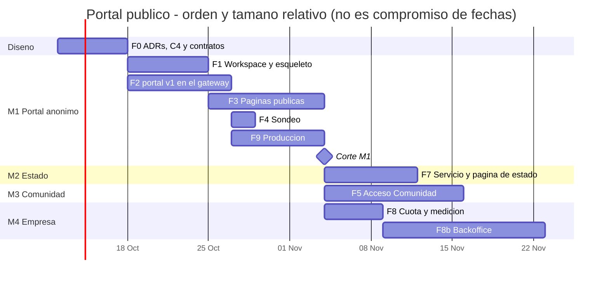

# Plan de implementación — Portal público de Criterio

- **Estado:** draft — pendiente de aprobación HITL
- **Fecha:** 2026-10-05
- **Decisores:** Jeremi Alcalá
- **Fase AI-DLC:** 03-implementation
- **Versión:** Unreleased (se sincroniza al próximo corte)

Cómo se construye el portal, PR a PR. **Qué** tiene que hacer y cómo se
comprueba está en el PRD (`docs/01-requirements/portal-publico-prd.md`). **Por
qué** está en las ADR-0028 a ADR-0033. Este plan no repite ninguno de los dos:
los cita.

## Punto de partida (2026-10-05)

Lo que el plan da por cierto, verificado en el código y en la base:

- **No hay producción.** `hgtech001` tiene montado el receptor de despliegue
  continuo del gateway (`higerotech/despliegue-continuo`), pero hoy todo corre
  en la máquina de desarrollo, detrás del túnel `criterio-dev`.
  **Poner producción en pie es parte de este plan** (fase 9). No es un paso
  final de «subir a producción».
- **El portal se sirve desde Cloudflare Workers** (decisión del 2026-10-05). Sus
  páginas sobreviven a una caída de `hgtech001`, que sigue sirviendo la API, el
  estado y el backoffice.
- **El gateway** (`apps/api-gateway`) tiene arquitectura hexagonal:
  - casos de uso en `application/consultas.py`;
  - lecturas en `adapters/timescale/repository.py`;
  - limitador en `domain/rate_limit.py`.

  **No lee la IP real del cliente**, y su limitador no poda claves (ADR-0028
  §3).
- **El `web-spa`** tiene 35 componentes:
  - **17 no dependen** de `api/`, `state/` ni `ws/`;
  - de los otros 18, **casi todos solo leen `marketStore`** en tiempo de
    ejecución, y de `api/` importan tipos.

  Pasarlos al paquete compartido es subir esa lectura a la vista, no
  reescribirlos (ADR-0031).
- **Datos:** la tasa oficial ya se captura en USD, EUR, CNY, TRY y RUB. No hace
  falta ingesta nueva.
- **CI:** `ci.yml` (Python y web-spa), `e2e-vivo.yml`, `seguridad.yml` (T8,
  SAST, DAST) y `build-api-gateway.yml` (imagen a GHCR). **Ningún workflow
  despliega el `web-spa`**.

## Cómo se trabaja

- **Un PR = un cambio que se puede revisar y revertir solo.** Nada de PRs de
  fase. Cada uno deja `develop` desplegable.
- **Primero las pruebas.** Cada PR lleva, del PRD o de la ADR, la prueba que lo
  demuestra. Las pruebas de seguridad de las secciones «Verificación» de las
  ADR entran **en el mismo PR** que el control, no después.
- **Primero el contrato.** Un endpoint nuevo empieza por su spec
  (`portal-openapi.yaml`, `estado-openapi.yaml`, `admin-openapi.yaml`). El PR
  que lo implementa trae el test de contrato contra ella.
- **CHANGELOG** en cada PR. **Push condicionado al estado del PR**
  (`~/.claude/CLAUDE.md`, sección Git).
- **Tallas:** S ≈ 1 día, M ≈ 2–3 días, L ≈ 4–6 días de trabajo efectivo.
  Ordenan y dimensionan; **no son una fecha comprometida**.

## Hitos

| Hito | Qué queda en pie | Fases |
|---|---|---|
| **M1 — Portal anónimo en producción** | Producto, Dashboard, APIs y Precios, en vivo y sin cuenta, en `criterio.higerotech.com` | 0, 1, 2, 3, 4, 9 |
| **M2 — Estado público** | página de estado con sondeo propio y sondeo externo | 7 |
| **M3 — Acceso Comunidad** | Intradía e Histórico con email | 5 |
| **M4 — Primer cliente Empresa** | credenciales M2M, cuota por cliente, backoffice | 8, 8b |

M1 va primero porque **no toca la autenticación**: es el portal que más gente
ve, con el menor riesgo. M3 y M4 son independientes entre sí. **M4 no puede
abrirse a un cliente** sin el backoffice y la medición de uso.

## Fase 0 — Cierre del diseño (Gate 1 incremental)

Lo que falta para que el diseño cubra los componentes nuevos. Es solo
documentación.

| PR | Contenido | Talla |
|---|---|---|
| 0.1 | **ADR-0034, placement del portal en Cloudflare Workers** (static assets). Plantilla de placement del AI-DLC con **precios verificados en la web, con fecha**, no de memoria. Incluye el CD: GitHub Actions + `wrangler deploy` tras el CI, porque el portal vive en un monorepo con tests. Cabeceras y CSP con `_headers`. | S |
| 0.2 | **ADR-0035, puesta en producción en `hgtech001`.** Todo el compose en la máquina. CD por servicio extendiendo el receptor existente. **Datos de arranque restaurados del último full en B2**, que de paso es el simulacro de recuperación. Dominios. Cloudflare Access para el backoffice. | M |
| 0.3 | `architecture.md` y C4 Container con `estado`, `backoffice`, `backoffice-api`, el portal en el borde y los caminos sin token. C4 Deployment de `hgtech001` y Cloudflare. | M |
| 0.4 | **Contratos:** `portal-openapi.yaml` (snapshot, series y rutas Comunidad), `estado-openapi.yaml` y `admin-openapi.yaml`. Todos con `additionalProperties: false`. | M |

**Sale de la fase:** el Gate 1 incremental aprobado (HITL), con el C4, los
contratos y las dos ADR.

## Fase 1 — Workspace y esqueleto

| PR | Contenido | Prueba que lo cierra | Talla |
|---|---|---|---|
| 1.1 | **Workspace npm en la raíz**, **sin mover nada** (ADR-0031 §3). Toca: `package.json` raíz, lockfile único, `ci.yml`, `apps/web-spa/Dockerfile`, `scripts/auditar-npm.mjs` y `seguridad.yml`. | CI verde; la imagen del `web-spa` sirve igual; `T8 · SCA (npm)` audita el lockfile raíz | M |
| 1.2 | **`packages/criterio-ui`**: tokens del DS, `i18n/`, `theme/` y los **17 componentes sin dependencias**. El `web-spa` los importa del paquete. Regla de lint: el paquete no importa de `api/`, `state/`, `ws/` ni `auth/`. | Suite del `web-spa` verde importando del paquete; el lint falla si se viola la regla | M |
| 1.3 | **`apps/portal`**: router (`/`, `/dashboard`, `/intradia`, `/historico`, `/apis`, `/precios`, `/estado`), layout, barra, pie, ES/EN y tema. **Prerender** de las rutas sin datos. Despliegue de **preview en Workers** por PR. | `curl` al build: HTML con contenido en `/`, `/precios` y `/apis` | M |
| 1.4 | Job del portal en `ci.yml` (typecheck, lint, test y build), en `seguridad.yml` (SAST y SCA) y despliegue a Workers en push a `main`. | Un PR crea preview; un merge a `main` publica | S |

## Fase 2 — Lectura pública en el gateway (`/portal/v1`)

El orden importa: **primero la IP real y el limitador**. Arreglan también
`/api/v1` y son la base de todo lo demás.

| PR | Contenido | Prueba que lo cierra | Talla |
|---|---|---|---|
| 2.1 | **IP real** desde `CF-Connecting-IP`, solo desde `TRUSTED_PROXIES` (RF-13). **Poda y tope de claves** en el limitador. | Las de ADR-0028 §Verificación: cabecera falsificada sin proxy de confianza; dos IP tras el conector con cuotas independientes; el limitador vuelve a su tamaño | M |
| 2.2 | **Caché en proceso con *single-flight*** como adaptador genérico (TTL por clave), con reloj inyectable. | N peticiones concurrentes con la caché fría → 1 cómputo | S |
| 2.3 | **`GET /portal/v1/snapshot`**. Caso de uso nuevo que compone los existentes (`ConsultarAnalisisVigente`, `ConsultarIndicadoresVigentes`, `ConsultarReferenciaP2P` por lado, `ConsultarTasaOficialVigente` × 5 monedas, `ConsultarProfundidad` y `ConsultarSenales` de 30 días). **Lista blanca campo a campo**, `Cache-Control` y cuota de 600/min por IP. | Contrato con `additionalProperties: false`; ningún `merchant_ref`; `?from=` → 422 | L |
| 2.4 | **`GET /portal/v1/dashboard/series`** con ventanas fijas (24 h, 14 d × 1 h, 30 d) y TTL de 60 s. | Contrato; ningún parámetro libre | M |
| 2.5 | Origen del portal en `ALLOWED_ORIGINS`; **CORS** del playground. | `tests/unit/test_cors.py` ampliado | S |

## Fase 3 — Páginas públicas

| PR | Contenido | Prueba que lo cierra | Talla |
|---|---|---|---|
| 3.1 | **Componentes del Dashboard al paquete** (los 18 con dependencias). La lectura de `marketStore` sube a `DashboardView`. **El `web-spa` no cambia de comportamiento.** | Suite del `web-spa` verde; regla de lint del paquete | L |
| 3.2 | **Dashboard** del portal sobre el snapshot (RF-2), con cronología sin «N de M» y las cinco monedas. | Test de componente: ningún texto de aciertos; estado vacío por panel | M |
| 3.3 | **Landing de Producto** (RF-1): hero y las cuatro promesas, con los paneles del paquete y el mismo snapshot. Casos de uso y CTA. | Prerender con contenido; los paneles se llenan del snapshot | M |
| 3.4 | **APIs** (RF-7): catálogo **generado en el build** desde `openapi.yaml` y `asyncapi.yaml`, y playground contra el gateway. | Cambiar un parámetro en el YAML cambia el catálogo; `/health` 200 y el resto 401 | M |
| 3.5 | **Precios** (RF-8) y **pie y aviso de privacidad** como páginas estáticas. | Prerender | S |

## Fase 4 — En vivo por sondeo

| PR | Contenido | Prueba que lo cierra | Talla |
|---|---|---|---|
| 4.1 | Hook de sondeo (RF-3): 10 s; se para con la pestaña oculta; retroceso con jitter ante 429 o 5xx, respetando `Retry-After`; barra «actualizado hace N s» con la edad de `as_of`. | Las tres de ADR-0028 §5: pestaña oculta → 0 peticiones; `Retry-After: 30` respetado; edad de `as_of` | M |

## Fase 9 — Producción (necesaria para M1)

Va antes que las fases 5–8 porque **M1 la necesita**, y porque las demás se
despliegan sobre ella.

| PR / tarea | Contenido | Prueba que lo cierra | Talla |
|---|---|---|---|
| 9.1 | **`hgtech001` en pie con el compose completo**, con secretos nuevos para producción (no los de desarrollo). | Todos los servicios `healthy` | M |
| 9.2 | **Datos de arranque restaurados del último full en B2** con `restaurar`. Es el **simulacro de recuperación**: se mide el tiempo de punta a punta. | Mismas comprobaciones que `verificar` (chunks, `post_restore`, edad del dato); tiempo anotado en la ADR-0035 | M |
| 9.3 | **CD por servicio**: imágenes a GHCR para ingestores, motor, `estado` y `backoffice-api`, y el receptor ampliado. | Un merge a `main` despliega y el receptor publica `current_tag` | M |
| 9.4 | **Dominios y borde:** `criterio.higerotech.com` en Workers, `api.` y `estado.` por el túnel de producción, *Cache Rule* para `/portal/v1/*` y el backoffice tras Access. | `curl` a cada hostname; respuesta servida desde la caché del borde en `/portal/v1/snapshot` | M |
| 9.5 | **El respaldo pasa a correr en producción**, contra la base de producción, con el mismo bucket u otro prefijo (lo decide ADR-0035). El de desarrollo se apaga. | `verificar` en OK en producción | S |
| 9.6 | **Corte de M1:** humo en producción. | Las métricas técnicas del PRD: frescura ≤ 15 s, ≤ 12 cómputos del snapshot por minuto | S |

## Fase 7 — Estado (M2)

| PR | Contenido | Prueba que lo cierra | Talla |
|---|---|---|---|
| 7.1 | **`apps/estado`**: servicio, esquema `estado`, rol de base de solo lectura más su esquema, y migración de la hipertabla con retención de 90 días. | Migración idempotente; el rol no escribe fuera de `estado` | M |
| 7.2 | **Sondas de los seis componentes** con los umbrales de ADR-0032 §1, y **agregado diario con «sin datos»**. | Las de ADR-0032: gateway parado → caído; sondeo parado → «sin datos» | M |
| 7.3 | **`GET /estado/v1`** (caché de 30 s, IP real, lista blanca), en ruta de túnel propia. | Contrato; responde con el gateway parado | S |
| 7.4 | **Incidentes en YAML** con esquema validado en CI. **Sondeo externo** en GitHub Actions con aviso por ntfy. | Un YAML mal formado rompe el CI; una caída del portal llega por ntfy | S |
| 7.5 | **Página de Estado** del portal. Si `/estado/v1` no responde, lo dice: «no podemos medir: `hgtech001` sin respuesta». | Test de componente de los tres casos: operativo, sin datos y sin respuesta | M |

## Fase 5 — Acceso Comunidad (M3)

| PR / tarea | Contenido | Prueba que lo cierra | Talla |
|---|---|---|---|
| 5.1 | **Spike** (ADR-0029 §4–5): ¿Bot Detection de Auth0 con Turnstile o `POST /portal/v1/acceso` con cliente confidencial? ¿Enlace o código? Resultado: enmienda a la ADR-0029. | Decisión escrita con evidencia del tenant | S |
| 5.2 | **Resend:** subdominio de envío, SPF, DKIM y DMARC en Cloudflare, y SMTP en Auth0. | Cabeceras de un correo real con `pass` | S |
| 5.3 | **Auth0:** conexión Passwordless, rol `comunidad` con `read:portal-comunidad`, y la Action de post-login **versionada en `infra/auth0/`**. | Un token Comunidad contra cada ruta de `/api/v1` → 403 | M |
| 5.4 | **Turnstile en servidor y límites** (3/h por email, 10/h por IP) con respuesta uniforme, según lo que decida el spike. | Las de ADR-0029 §Verificación | M |
| 5.5 | **Rutas Comunidad de `/portal/v1`** (Intradía e Histórico), con rangos enumerados y permiso `read:portal-comunidad`. | Contrato; 401 sin token y 403 con token sin permiso | M |
| 5.6 | **Intradía e Histórico** en el portal: componentes de sesión e histórico al paquete, y vistas. | Sin «Vigilar esta regla»; columnas Casos · Con resultado · Efecto medio · Muestra | L |
| 5.7 | **Aviso de privacidad** publicado: el borrador de `docs/legal/` revisado y con los corchetes completos. **Bloquea abrir el alta.** | Revisión HITL | S |

## Fase 8 — Nivel Empresa (M4, parte del gateway)

| PR | Contenido | Prueba que lo cierra | Talla |
|---|---|---|---|
| 8.1 | **Cuota por claim** (`rate_limit_per_min`). Las personas siguen con `RATE_LIMIT_PER_MIN`. | Petición 201 de un token con claim 200 → 429; un usuario del `web-spa` sigue con 120 | S |
| 8.2 | **Medición de uso**: peticiones y 429 por `client_id` y por hora, volcados a una tabla, **sin IPs**. | Tras N peticiones, la tabla cuenta N | M |
| 8.3 | **Action de credentials exchange** en `infra/auth0/` (claim de cuota y, si no hay cuota nativa, consulta al contador con *fail-open*). | Las de ADR-0033 §5 | M |
| 8.4 | **Guía de alta del cliente**: reutilizar el token 24 h, cachearlo en disco y compartirlo entre réplicas. | Revisión HITL | S |

## Fase 8b — Backoffice (M4)

| PR | Contenido | Prueba que lo cierra | Talla |
|---|---|---|---|
| 8b.1 | **`apps/backoffice-api`**: esquema `backoffice`, rol propio y auditoría de solo inserción. Login con rol `admin` y MFA. | Sin Access, ninguna ruta responde; con Access y sin `admin`, 403 | M |
| 8b.2 | **Clientes y pagos** (estados y USDT). | Contrato de `admin-openapi.yaml` | M |
| 8b.3 | **Habilitación M2M** con Management API de permisos mínimos: crear, suspender, rotar y dar de baja. Secreto mostrado una vez, entrega por enlace de un solo uso. | Rotar invalida el secreto anterior; el secreto no aparece en logs ni en la auditoría | L |
| 8b.4 | **Cupo:** contador, avisos al 80/85/90/95 % por Resend, alerta «fuera de fecha» por ntfy, corte al 100 % (cuota nativa o Action), conciliación horaria con los logs de Auth0 y reactivación el día 1. | Las de ADR-0033 §Verificación | L |
| 8b.5 | **`apps/backoffice`** (UI): clientes, pagos, habilitación, consumo, capacidad y auditoría, con el paquete compartido. | Test de componente por pantalla | L |

## Calendario orientativo

*Eje trazabilidad, fase 03: el orden y las dependencias entre fases. Las
duraciones salen de las tallas de las tablas, para una persona con el agente.
Sirven para ver el camino crítico (F1 → F3 → M1, con F2 y F9 en paralelo), no
como compromiso de fechas.*

## Pruebas por gate

- **Gate 2 (implementación):**
  - cada PR con su prueba de la tabla;
  - cobertura de ramas ≥ 80 % en `apps/portal`, `packages/criterio-ui`,
    `apps/estado` y `apps/backoffice-api`, el criterio que ya cumple el resto
    del repo;
  - `gitGraph` regenerado con `gitgraph_from_log.py` tras cada corte.
- **Gate 3 (pruebas):**
  - el `requirementDiagram` del PRD con relaciones `verifies` completas;
  - el **DAST de `seguridad.yml` ampliado** a `/portal/v1` y `/estado/v1`, sin
    token: es la superficie nueva de T16–T18;
  - un **e2e en vivo** del portal contra producción en `e2e-vivo.yml`.
- **Gate 4 (despliegue):**
  - C4 Deployment;
  - pipeline con *rollback* documentado (Workers guarda las versiones
    anteriores y el receptor revierte por tag);
  - **simulacro de recuperación medido** (9.2).

## Decisiones que quedan abiertas

| # | Decisión | Bloquea | Recomendación |
|---|---|---|---|
| D12 | **Dominio de producción.** `criterio.higerotech.com` es el que inventó el diseño. | 9.4 | Confirmarlo, con `api.` y `estado.` como subdominios |
| D13 | **¿El respaldo de producción comparte el bucket `ves-market-watch` o usa uno propio?** | 9.5 | Bucket propio: separa el cupo de descarga y la retención de desarrollo |
| D14 | **Cómo se miden las métricas de producto sin cookies** (PRD, «Métricas de éxito») | Nada antes de M1 | Logs del borde de Cloudflare: no exigen código en el portal |
| — | **Cuota nativa de tokens en Auth0**, y si los tokens de usuario cuentan contra los 1.000 | 8.3 y 8b.4 | Verificarlo en el tenant antes de empezar la fase 8 |
| — | **Objetivos de las métricas de producto** | Nada antes de M1 | Fijarlos con un mes de datos de M1 |

## Riesgos del plan

- **La puesta en producción es trabajo nuevo,** no un despliegue: máquina,
  secretos, CD de seis servicios, dominios y Access. Por eso está en el camino
  de M1 y no al final.
- **El PR 3.1, que mueve 18 componentes, es el más grande** y toca el `web-spa`.
  Si crece, se parte por bloques del Dashboard. La suite del `web-spa` es la red.
- **La memoria de la máquina de desarrollo** ya se quedó corta el 2026-10-05,
  restaurando un full junto a la base viva. El simulacro de recuperación (9.2)
  va contra `hgtech001`, no contra la máquina de desarrollo.
- **Auth0 marca el techo** de M4: 29 clientes con el plan actual (ADR-0030).
