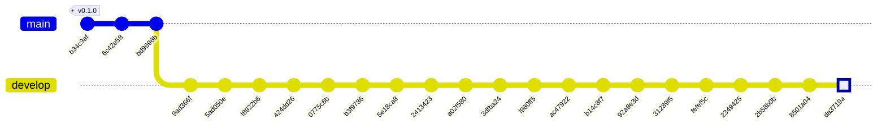

## Historial del repositorio (documentación viva)

Derivado de `git log` con `scripts/gitgraph_branches.py`
(ramas vivas: `main`, `develop`, `feat-ai-dlc`). Regenerar tras cada commit,
merge o tag relevante. Los tags SemVer enlazan con las versiones del `CHANGELOG.md`.

> Nota: historia entrelazada u octopus — el gitGraph es aproximado; la bitácora es la fuente de verdad.

### Grafo de commits y ramas

### Estado actual de las ramas

| Rama | Punta | Fecha | Commits propios |
|---|---|---|---|
| `main` | `bd9698b` | 2026-07-05 | 3 |
| `develop` | `da3719a` | 2026-07-14 | 20 |
| `feat-ai-dlc` | `8501a04` | 2026-07-14 | 0 |

### Bitácora de cambios (fiel al repo)

| Commit | Tipo | Tags | Autor | Fecha | Mensaje |
|---|---|---|---|---|---|
| `da3719a` | merge | — | Jeremi Alcala | 2026-07-14 | Merge feat-ai-dlc into develop: ingestor-historico (ADR-0013), multi-branch gitGraph, three-axis diagram evidence |
| `023b71b` | merge | — | Jeremi Alcala | 2026-07-14 | On feat-ai-dlc: user local: ignore config.json |
| `6ee3cdb` | commit | — | Jeremi Alcala | 2026-07-14 | index on feat-ai-dlc: 8501a04 docs: Complete three-axis Mermaid evidence for Gates 0/1 (AI-DLC coherence audit) |
| `8501a04` | commit | — | Jeremi Alcala | 2026-07-14 | docs: Complete three-axis Mermaid evidence for Gates 0/1 (AI-DLC coherence audit) |
| `2b58b0b` | commit | — | Jeremi Alcala | 2026-07-11 | feat: Add multi-branch gitGraph generator and update repo history documentation |
| `2349425` | commit | — | Jeremi Alcala | 2026-07-11 | feat: Update documentation for ingestor-historico service and changelog with approval status and versioning |
| `fefef5c` | commit | — | Jeremi Alcala | 2026-07-11 | feat: Update project charter with additional scope, stakeholders, and success metrics |
| `31289f5` | commit | — | Jeremi Alcala | 2026-07-11 | feat: Implement historical data ingestion service with adaptive parsing |
| `92a9e3d` | commit | — | Jeremi Alcala | 2026-07-11 | feat: Add Dockerfiles for ingestor-binance, ingestor-bcv, and indicator-engine; create .dockerignore and analysis script |
| `b14c8f7` | commit | — | Jeremi Alcala | 2026-07-11 | feat: Update documentation for version 0.2.0, closing Gates 0 and 1, and add implementation history |
| `ac47922` | commit | — | Jeremi Alcala | 2026-07-11 | feat: Update API contracts and architecture to integrate Auth0 for authentication |
| `f980ff5` | commit | — | Jeremi Alcala | 2026-07-07 | feat: Update Gate 0 and Gate 1 documentation with resolution of alias retention and ADR-0011 implementation details |
| `3dfba24` | commit | — | Jeremi Alcala | 2026-07-06 | feat: Implement ADR-0011 for P2P advertiser pseudonymization |
| `a02f580` | commit | — | Jeremi Alcala | 2026-07-06 | feat: Implement ADR-0011 for HMAC pseudonymization of P2P advertiser identifiers and update related documentation |
| `2413423` | commit | — | Jeremi Alcala | 2026-07-06 | feat: Implement data minimization for P2P snapshots and update documentation |
| `5e18ca8` | commit | — | Jeremi Alcala | 2026-07-06 | feat: Implement P2P snapshot ingestion from Binance |
| `b3f9786` | commit | — | Jeremi Alcala | 2026-07-05 | Implementación de la fase 1 del motor de indicadores en `indicator-engine`: consumo de eventos `official.rate.updated`, validación de schema, DLQ, idempotencia y emisión de `indicators.updated`. Se agregan pruebas E2E, de integración y unitarias para asegurar el correcto funcionamiento del flujo de datos. Se actualizan los contratos de eventos y se añaden esquemas JSON para validación. Se realizan cambios en la documentación para reflejar el estado actual del proyecto y las tablas implementadas en la base de datos. |
| `0775c6b` | commit | — | Jeremi Alcala | 2026-07-05 | feat: Implement HITL re-validation for suspect rates (ADR-0007) |
| `424dd26` | commit | — | Jeremi Alcala | 2026-07-05 | Update configuration and documentation for local development setup |
| `f8922b6` | commit | — | Jeremi Alcala | 2026-07-05 | Add Open Knowledge Format (OKF) context bundle and enhance documentation |
| `5ad050e` | commit | — | Jeremi Alcala | 2026-07-05 | Add initial documentation for services, events, metrics, and tables in the VES Market Watch project |
| `9ad366f` | commit | — | Jeremi Alcala | 2026-07-05 | Add unit tests for BCV ingestor functionality and update documentation |
| `bd9698b` | commit | — | Jeremi Alcala | 2026-07-05 | Update design documentation and add new ADRs for state machine and bitemporal model |
| `6c42e58` | commit | — | Jeremi Alcala | 2026-07-05 | Add initial changelog documenting project milestones and structure |
| `b34c3af` | commit | v0.1.0 | Jeremi Alcala | 2026-07-05 | first commit |
