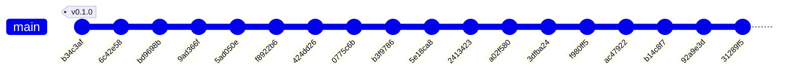

# Historial de implementación — VES Market Watch

* **Estado:** review
* **Fecha:** 2026-07-11 (regenerado tras el commit `31289f5`)
* **Decisores:** Jeremi Alcalá
* **Fase AI-DLC:** 03-implementation
* **Versión:** 0.2.0
* **Gate:** 2
* **Rama principal:** main
* **Estrategia de branching:** GitFlow (main + develop + ramas feature)

## Historial del repositorio (documentación viva)

Derivado de `git log` con `scripts/gitgraph_from_log.py` (skill ai-dlc). Regenerar tras cada
merge o tag para mantener la traza sincronizada (docs-as-code: derivar, no duplicar) y volver
a anteponer esta cabecera. Los tags SemVer enlazan con las versiones del `CHANGELOG.md`.

### Grafo de commits y merges

*(Eje de trazabilidad, fase 03 — rama `feat-ai-dlc` (pusheada a origin); `develop` quedó en `ac47922` y `main` en `bd9698b`, pendientes de merge.)*

### Bitácora de cambios (fiel al repo)

| Commit | Tipo | Tags | Autor | Fecha | Mensaje |
|---|---|---|---|---|---|
| `31289f5` | commit | — | Jeremi Alcala | 2026-07-11 | feat: Implement historical data ingestion service with adaptive parsing |
| `92a9e3d` | commit | — | Jeremi Alcala | 2026-07-11 | feat: Add Dockerfiles for ingestor-binance, ingestor-bcv, and indicator-engine; create .dockerignore and analysis script |
| `b14c8f7` | commit | — | Jeremi Alcala | 2026-07-11 | feat: Update documentation for version 0.2.0, closing Gates 0 and 1, and add implementation history |
| `ac47922` | commit | — | Jeremi Alcala | 2026-07-11 | feat: Update API contracts and architecture to integrate Auth0 for authentication |
| `f980ff5` | commit | — | Jeremi Alcala | 2026-07-07 | feat: Update Gate 0 and Gate 1 documentation with resolution of alias retention and ADR-0011 implementation details |
| `3dfba24` | commit | — | Jeremi Alcala | 2026-07-06 | feat: Implement ADR-0011 for P2P advertiser pseudonymization |
| `a02f580` | commit | — | Jeremi Alcala | 2026-07-06 | feat: Implement ADR-0011 for HMAC pseudonymization of P2P advertiser identifiers and update related documentation |
| `2413423` | commit | — | Jeremi Alcala | 2026-07-06 | feat: Implement data minimization for P2P snapshots and update documentation |
| `5e18ca8` | commit | — | Jeremi Alcala | 2026-07-06 | feat: Implement P2P snapshot ingestion from Binance |
| `b3f9786` | commit | — | Jeremi Alcala | 2026-07-05 | Implementación de la fase 1 del motor de indicadores en `indicator-engine`: consumo de eventos `official.rate.updated`, validación de schema, DLQ, idempotencia y emisión de `indicators.updated`. Se agregan pruebas E2E, de integración y unitarias para asegurar el correcto funcionamiento del flujo de datos. Se actualizan los contratos de eventos y se añaden esquemas JSON para validación. Se realizan cambios en la documentación para reflejar el estado actual del proyecto y las tablas implementadas en la base de datos. |
| `0775c6b` | commit | — | Jeremi Alcala | 2026-07-05 | feat: Implement HITL re-validation for suspect rates (ADR-0007) |
| `424dd26` | commit | — | Jeremi Alcala | 2026-07-05 | Update configuration and documentation for local development setup |
| `f8922b6` | commit | — | Jeremi Alcala | 2026-07-05 | Add Open Knowledge Format (OKF) context bundle and enhance documentation |
| `5ad050e` | commit | — | Jeremi Alcala | 2026-07-05 | Add initial documentation for services, events, metrics, and tables in the VES Market Watch project |
| `9ad366f` | commit | — | Jeremi Alcala | 2026-07-05 | Add unit tests for BCV ingestor functionality and update documentation |
| `bd9698b` | commit | — | Jeremi Alcala | 2026-07-05 | Update design documentation and add new ADRs for state machine and bitemporal model |
| `6c42e58` | commit | — | Jeremi Alcala | 2026-07-05 | Add initial changelog documenting project milestones and structure |
| `b34c3af` | commit | v0.1.0 | Jeremi Alcala | 2026-07-05 | first commit |

## Trazabilidad tag ↔ versión ↔ decisión

| Tag | Versión CHANGELOG | ADR / feature | Nota |
|---|---|---|---|
| v0.1.0 | 0.1.0 — línea base documental (Gates 0 y 1 en borrador) | ADR-0001…0006; 4 PRDs; threat model v1 | Commit inicial `b34c3af`, 2026-07-05. Sin código ejecutable |
| `<TODO: taggear v0.2.0>` | 0.2.0 — Gates 0 y 1 cerrados (HITL 2026-07-11) | ADR-0007…0012; ingestor-bcv, indicator-engine fase 1 e ingestor-binance implementados; contrato p2p-snapshot v1.1 (ADR-0011); auth OIDC/Auth0 (ADR-0012) | Corte documentado en `b14c8f7`. Taggear sobre el merge a `main` para que el grafo lo recoja |
| — (en `[Unreleased]`) | próximo corte | **ADR-0013** + PRD ingesta histórica (approved, HITL 2026-07-11): `ingestor-historico` implementado (`31289f5`); Dockerfiles de los 3 servicios de datos (`92a9e3d`) | Rama `feat-ai-dlc`, pendiente de merge a `develop`/`main` |
