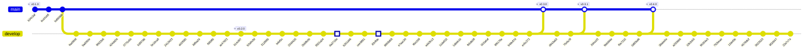

# Historial de implementación — VES Market Watch

* **Estado:** review (documentación viva — regenerada por script, no editar a mano)
* **Fecha:** 2026-07-31
* **Decisores:** Jeremi Alcalá
* **Fase AI-DLC:** 03-implementation
* **Versión:** 0.4.0
* **Gate:** 2
* **Rama principal:** main
* **Estrategia de branching:** GitFlow (main + develop + ramas feature)

## Historial del repositorio (documentación viva)

Derivado de `git log` con `scripts/gitgraph_branches.py`
(ramas vivas: `main`, `develop`). Regenerar tras cada commit,
merge o tag relevante. Los tags SemVer enlazan con las versiones del `CHANGELOG.md`.

> Nota: historia entrelazada u octopus — el gitGraph es aproximado; la bitácora es la fuente de verdad.

### Grafo de commits y ramas

```mermaid
gitGraph
    commit id: "b34c3af" tag: "v0.1.0"
    commit id: "6c42e58"
    commit id: "bd9698b"
    branch develop
    commit id: "9ad366f"
    commit id: "5ad050e"
    commit id: "f8922b6"
    commit id: "424dd26"
    commit id: "0775c6b"
    commit id: "b3f9786"
    commit id: "5e18ca8"
    commit id: "2413423"
    commit id: "a02f580"
    commit id: "3dfba24"
    commit id: "f980ff5"
    commit id: "ac47922"
    commit id: "b14c8f7" tag: "v0.2.0"
    commit id: "92a9e3d"
    commit id: "31289f5"
    commit id: "fefef5c"
    commit id: "2349425"
    commit id: "2b58b0b"
    commit id: "8501a04"
    commit id: "da3719a" type: HIGHLIGHT
    commit id: "b251d46"
    commit id: "cee9891"
    commit id: "83cffde" type: HIGHLIGHT
    commit id: "8658d68"
    commit id: "e7aac30"
    commit id: "f8a159f"
    commit id: "ed42b13"
    commit id: "11da932"
    commit id: "1d6eb1b"
    commit id: "fb5db08"
    commit id: "002a6af"
    commit id: "8f9178e"
    commit id: "949e87d"
    commit id: "ec6c272"
    checkout main
    merge develop tag: "v0.3.0"
    checkout develop
    commit id: "d943a62"
    commit id: "75e6c3f"
    checkout main
    merge develop tag: "v0.3.1"
    checkout develop
    commit id: "2d4a1f2"
    commit id: "9b6d94e"
    commit id: "f5a7215"
    commit id: "0d80bd6"
    checkout main
    merge develop tag: "v0.4.0"
    checkout develop
    commit id: "38abe5e"
    commit id: "a230666"
    commit id: "10b3cb5"
    commit id: "95354e3"
    commit id: "792beae"
    commit id: "12def0b"
    commit id: "4578db2"
    commit id: "3622623"
    commit id: "8f30547"
    commit id: "22a7c7a"
```

### Estado actual de las ramas

| Rama | Punta | Fecha | Commits en su lane |
|---|---|---|---|
| `main` | `779231f` | 2026-07-26 | 6 |
| `develop` | `22a7c7a` | 2026-07-31 | 50 |

### Trazabilidad tag ↔ versión ↔ decisión

| Tag | Commit | Fecha | Versión CHANGELOG | ADR / feature | Nota |
|---|---|---|---|---|---|
| v0.1.0 | `b34c3af` | 2026-07-05 | 0.1.0 | ADR-0001…0006; 4 PRDs; threat model v1 | Línea base documental (Gates 0 y 1 en borrador). Sin código ejecutable |
| v0.2.0 | `b14c8f7` | 2026-07-11 | 0.2.0 | Gates 0 y 1 cerrados (HITL); ADR-0007…0012; ingestor-bcv, indicator-engine fase 1, ingestor-binance | Tres servicios implementados y verificados en vivo |
| v0.3.0 | `2ec16da` | 2026-07-26 | 0.3.0 | ADR-0013…0015; ingestor-historico; engine fase 2 (microestructura P2P) + motor de señales RF-4/RF-5; OpenAPI del gateway | Cierre funcional del pipeline de datos; api-gateway aún sin código |
| v0.3.1 | `461d4dc` | 2026-07-26 | 0.3.1 | Barrido de coherencia documental post-0.3.0; threat model T13/T14; trazabilidad tag↔ADR restaurada; design.md del ingestor-historico | Patch solo de docs, sin cambios funcionales |
| v0.4.0 | `779231f` | 2026-07-26 | 0.4.0 | ADR-0016; api-gateway implementado (REST /api/v1 + WSS /ws/v1, Resource Server Auth0, 78 tests); AsyncAPI del WSS; OpenAPI ajustada | Los 5 servicios con código; pipeline completo fuente → bus → REST/WSS operativo. Pendiente HITL: SPA + client M2M de prueba |

### Bitácora de cambios (fiel al repo)

| Commit | Tipo | Tags | Autor | Fecha | Mensaje |
|---|---|---|---|---|---|
| `22a7c7a` | commit | — | Jeremi Alcala | 2026-07-31 | docs: barridos de coherencia (gates, charter, PRDs, plan de pruebas, knowledge) |
| `8f30547` | commit | — | Jeremi Alcala | 2026-07-31 | feat(web-spa): rediseno Higerotech, i18n ES/EN y sello de bloque sin fuente (ADR-0018) |
| `3622623` | commit | — | Jeremi Alcala | 2026-07-31 | fix(api-gateway): reconectar y alertar el consumidor AMQP del push WSS |
| `4578db2` | commit | — | Jeremi Alcala | 2026-07-29 | docs: front-end en el alcance (ADR-0017) y corrección del plan de pruebas |
| `12def0b` | commit | — | Jeremi Alcala | 2026-07-29 | feat(web-spa): dashboard, histórico e intradía (ADR-0017) |
| `792beae` | commit | — | Jeremi Alcala | 2026-07-29 | fix(api-gateway): tolerar deriva de reloj al validar el JWT |
| `95354e3` | commit | — | Jeremi Alcala | 2026-07-29 | feat(api-gateway): CORS por allowlist para el SPA (T15) |
| `10b3cb5` | commit | — | Jeremi Alcala | 2026-07-29 | feat(api-gateway): filtros de indicador y moneda en /indicators/history |
| `a230666` | commit | — | Jeremi Alcala | 2026-07-26 | docs(repo-history): gitGraph con lanes GitFlow reales (first-parent en main) |
| `38abe5e` | commit | — | Jeremi Alcala | 2026-07-26 | docs: Regenerate repo-history tras el release 0.4.0 (merge a main + tag) |
| `779231f` | merge | v0.4.0 | Jeremi Alcala | 2026-07-26 | Merge develop into main: release 0.4.0 |
| `0d80bd6` | commit | — | Jeremi Alcala | 2026-07-26 | docs: Corte 0.4.0 — api-gateway implementado, pipeline completo operativo |
| `f5a7215` | commit | — | Jeremi Alcala | 2026-07-26 | Implement integration and unit tests for API Gateway functionality |
| `9b6d94e` | commit | — | Jeremi Alcala | 2026-07-26 | docs: Ratificación HITL del DREAD de T13/T14 (threat model + gate 1) |
| `2d4a1f2` | commit | — | Jeremi Alcala | 2026-07-26 | docs: Regenerate repo-history tras el release 0.3.1 (merge a main + tag) |
| `461d4dc` | merge | v0.3.1 | Jeremi Alcala | 2026-07-26 | Merge develop into main: release 0.3.1 |
| `75e6c3f` | commit | — | Jeremi Alcala | 2026-07-26 | docs: Corte 0.3.1 — barrido de coherencia post-0.3.0 (trazabilidad, threat model T13/T14, cabeceras) |
| `d943a62` | commit | — | Jeremi Alcala | 2026-07-26 | docs: Regenerate repo-history tras el release 0.3.0 (merge a main + tags) |
| `2ec16da` | merge | v0.3.0 | Jeremi Alcala | 2026-07-26 | Merge develop into main: release 0.3.0 |
| `ec6c272` | commit | — | Jeremi Alcala | 2026-07-26 | docs: Corte 0.3.0 — motor de señales verificado (RF-4/RF-5) |
| `949e87d` | commit | — | Jeremi Alcala | 2026-07-26 | fix(compose): restart unless-stopped en rabbitmq y timescaledb |
| `8f9178e` | commit | — | Jeremi Alcala | 2026-07-22 | docs: Flip signals to implemented (RF-4) + ADR-0015, e2e coherence |
| `002a6af` | commit | — | Jeremi Alcala | 2026-07-22 | feat(indicator-engine): Signal rules engine (RF-4) — emits signals.emitted |
| `fb5db08` | commit | — | Jeremi Alcala | 2026-07-20 | feat(schemas): Define signal.v1 contract for signals.emitted (schema only) |
| `1d6eb1b` | commit | — | Jeremi Alcala | 2026-07-20 | docs: Coherence pass post-fase-2 + ADR-0014 (microestructura P2P) |
| `11da932` | commit | — | Jeremi Alcala | 2026-07-20 | feat: Implementar procesamiento de snapshots P2P y cálculo de indicadores |
| `ed42b13` | commit | — | Jeremi Alcala | 2026-07-17 | feat(api-gateway): Add OpenAPI 3.1 REST spec (fase 03) |
| `f8a159f` | commit | — | Jeremi Alcala | 2026-07-17 | chore: Ignore config.json (Auth0 tenant config, fase 03 api-gateway) |
| `e7aac30` | commit | — | Jeremi Alcala | 2026-07-14 | docs: Close feat-ai-dlc branch, regenerate repo-history for main+develop |
| `8658d68` | commit | — | Jeremi Alcala | 2026-07-14 | docs: Regenerate repo-history after Auth0 tenant merge |
| `83cffde` | merge | — | Jeremi Alcala | 2026-07-14 | Merge feat-ai-dlc into develop: Auth0 dev tenant provisioned (api-gateway phase 03 start) |
| `cee9891` | commit | — | Jeremi Alcala | 2026-07-14 | docs: Record provisioned Auth0 dev tenant in api-gateway design (ADR-0012) |
| `b251d46` | commit | — | Jeremi Alcala | 2026-07-14 | docs: Regenerate repo-history after merging feat-ai-dlc into develop |
| `da3719a` | merge | — | Jeremi Alcala | 2026-07-14 | Merge feat-ai-dlc into develop: ingestor-historico (ADR-0013), multi-branch gitGraph, three-axis diagram evidence |
| `8501a04` | commit | — | Jeremi Alcala | 2026-07-14 | docs: Complete three-axis Mermaid evidence for Gates 0/1 (AI-DLC coherence audit) |
| `2b58b0b` | commit | — | Jeremi Alcala | 2026-07-11 | feat: Add multi-branch gitGraph generator and update repo history documentation |
| `2349425` | commit | — | Jeremi Alcala | 2026-07-11 | feat: Update documentation for ingestor-historico service and changelog with approval status and versioning |
| `fefef5c` | commit | — | Jeremi Alcala | 2026-07-11 | feat: Update project charter with additional scope, stakeholders, and success metrics |
| `31289f5` | commit | — | Jeremi Alcala | 2026-07-11 | feat: Implement historical data ingestion service with adaptive parsing |
| `92a9e3d` | commit | — | Jeremi Alcala | 2026-07-11 | feat: Add Dockerfiles for ingestor-binance, ingestor-bcv, and indicator-engine; create .dockerignore and analysis script |
| `b14c8f7` | commit | v0.2.0 | Jeremi Alcala | 2026-07-11 | feat: Update documentation for version 0.2.0, closing Gates 0 and 1, and add implementation history |
| `ac47922` | commit | — | Jeremi Alcala | 2026-07-11 | feat: Update API contracts and architecture to integrate Auth0 for authentication |
| `f980ff5` | commit | — | Jeremi Alcala | 2026-07-07 | feat: Update Gate 0 and Gate 1 documentation with resolution of alias retention and ADR-0011 implementation details |
| `3dfba24` | commit | — | Jeremi Alcala | 2026-07-06 | feat: Implement ADR-0011 for P2P advertiser pseudonymization |
| `a02f580` | commit | — | Jeremi Alcala | 2026-07-06 | feat: Implement ADR-0011 for HMAC pseudonymization of P2P advertiser identifiers and update related documentation |
| `2413423` | commit | — | Jeremi Alcala | 2026-07-06 | feat: Implement data minimization for P2P snapshots and update documentation |
| `5e18ca8` | commit | — | Jeremi Alcala | 2026-07-06 | feat: Implement P2P snapshot ingestion from Binance |
| `b3f9786` | commit | — | Jeremi Alcala | 2026-07-05 | Implementación de la fase 1 del motor de indicadores en `indicator-engine`: consumo de eventos `official.rate.updated`, validación de schema, DLQ, idempotencia y emisión de `indicators.updated`. Se agregan pruebas E2E, de integración y unitarias para asegurar el correcto funcionamiento del flujo de datos. Se actualizan los contratos de eventos y se añaden esquemas JSON para validación. Se realizan cambios en la documentación para reflejar el estado actual del proyecto y las tablas implementadas en la base de datos. |
| `0775c6b` | commit | — | Jeremi Alcala | 2026-07-05 | feat: Implement HITL re-validation for suspect rates (ADR-0007) |
| `424dd26` | commit | — | Jeremi Alcala | 2026-07-05 | Update configuration and documentation for local development setup |
| `f8922b6` | commit | — | Jeremi Alcala | 2026-07-05 | Add Open Knowledge Format (OKF) context bundle and enhance documentation |
| `5ad050e` | commit | — | Jeremi Alcala | 2026-07-05 | Add initial documentation for services, events, metrics, and tables in the VES Market Watch project |
| `9ad366f` | commit | — | Jeremi Alcala | 2026-07-05 | Add unit tests for BCV ingestor functionality and update documentation |
| `bd9698b` | commit | — | Jeremi Alcala | 2026-07-05 | Update design documentation and add new ADRs for state machine and bitemporal model |
| `6c42e58` | commit | — | Jeremi Alcala | 2026-07-05 | Add initial changelog documenting project milestones and structure |
| `b34c3af` | commit | v0.1.0 | Jeremi Alcala | 2026-07-05 | first commit |
