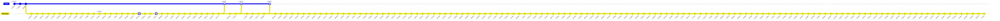

# Historial de implementación — Criterio

* **Estado:** review (documentación viva — regenerada por script, no editar a mano)
* **Fecha:** 2026-08-06
* **Decisores:** Jeremi Alcalá
* **Fase AI-DLC:** 03-implementation
* **Versión:** 0.4.0
* **Gate:** 2
* **Rama principal:** main
* **Estrategia de branching:** GitFlow (main + develop + ramas feature)

## Historial del repositorio (documentación viva)

Derivado de `git log` con `scripts/gitgraph_branches.py`
(ramas vivas: `main`, `develop`). Regenerar tras cada commit,
merge o tag relevante. Los tags SemVer enlazan con las versiones del `CHANGELOG.md`.

> Nota: historia entrelazada u octopus — el gitGraph es aproximado; la bitácora es la fuente de verdad.

### Grafo de commits y ramas

```mermaid
gitGraph
    commit id: "b34c3af" tag: "v0.1.0"
    commit id: "6c42e58"
    commit id: "bd9698b"
    branch develop
    commit id: "9ad366f"
    commit id: "5ad050e"
    commit id: "f8922b6"
    commit id: "424dd26"
    commit id: "0775c6b"
    commit id: "b3f9786"
    commit id: "5e18ca8"
    commit id: "2413423"
    commit id: "a02f580"
    commit id: "3dfba24"
    commit id: "f980ff5"
    commit id: "ac47922"
    commit id: "b14c8f7" tag: "v0.2.0"
    commit id: "92a9e3d"
    commit id: "31289f5"
    commit id: "fefef5c"
    commit id: "2349425"
    commit id: "2b58b0b"
    commit id: "8501a04"
    commit id: "da3719a" type: HIGHLIGHT
    commit id: "b251d46"
    commit id: "cee9891"
    commit id: "83cffde" type: HIGHLIGHT
    commit id: "8658d68"
    commit id: "e7aac30"
    commit id: "f8a159f"
    commit id: "ed42b13"
    commit id: "11da932"
    commit id: "1d6eb1b"
    commit id: "fb5db08"
    commit id: "002a6af"
    commit id: "8f9178e"
    commit id: "949e87d"
    commit id: "ec6c272"
    checkout main
    merge develop tag: "v0.3.0"
    checkout develop
    commit id: "d943a62"
    commit id: "75e6c3f"
    checkout main
    merge develop tag: "v0.3.1"
    checkout develop
    commit id: "2d4a1f2"
    commit id: "9b6d94e"
    commit id: "f5a7215"
    commit id: "0d80bd6"
    checkout main
    merge develop tag: "v0.4.0"
    checkout develop
    commit id: "38abe5e"
    commit id: "a230666"
    commit id: "10b3cb5"
    commit id: "95354e3"
    commit id: "792beae"
    commit id: "12def0b"
    commit id: "4578db2"
    commit id: "3622623"
    commit id: "8f30547"
    commit id: "22a7c7a"
    commit id: "5ed6042"
    commit id: "c852844"
    commit id: "aed25fa"
    commit id: "7ac255a"
    commit id: "f7280f1"
    commit id: "f074aab"
    commit id: "47d1286"
    commit id: "798b83b"
    commit id: "75bd24e"
    commit id: "f525868"
    commit id: "f50f890"
    commit id: "f307d18"
    commit id: "8978022"
    commit id: "b4ca2c5"
    commit id: "657184e"
    commit id: "af3a347"
    commit id: "3b440a4"
    commit id: "c543b08"
    commit id: "7471953"
    commit id: "28a1d5d"
    commit id: "df2c185"
    commit id: "ee29078"
    commit id: "219945f"
    commit id: "95dbde8"
    commit id: "04eab58"
    commit id: "dfb061e"
    commit id: "6b07555"
    commit id: "0d2ecd9"
    commit id: "027f056"
    commit id: "2a70922"
    commit id: "6c362a5"
    commit id: "149e8b3"
    commit id: "078d7f7"
    commit id: "4989144"
    commit id: "f9ca6cf"
    commit id: "e759414"
    commit id: "a0c26d3"
    commit id: "5720bf4"
    commit id: "df1c2a8"
    commit id: "2de8b70"
    commit id: "d1682ac"
    commit id: "6190faa"
    commit id: "d601b39"
    commit id: "85c492a"
    commit id: "31eb62b"
    commit id: "a8b8c02"
    commit id: "603705d"
    commit id: "4a2a69e"
    commit id: "592e4b5"
    commit id: "bf7aa01"
    commit id: "e0f5f8b"
    commit id: "1383830"
    commit id: "abef31d"
    commit id: "25cd440"
    commit id: "28c75b9"
    commit id: "0b42533"
    commit id: "9934d12"
    commit id: "166c528"
    commit id: "b533588"
    commit id: "8023c36"
    commit id: "6aab1bf"
    commit id: "c4f2630"
    commit id: "172f794"
    commit id: "7d0d712"
    commit id: "e7accd4"
    commit id: "ee39077"
    commit id: "98ea475"
    commit id: "b3d95fc"
    commit id: "534afa1"
    commit id: "be00558"
    commit id: "f0961fd"
    commit id: "b8b625a"
    commit id: "90d9100"
    commit id: "43f00b6"
    commit id: "ce5560b"
    commit id: "8549165"
    commit id: "834d032"
    commit id: "2a4fbef"
    commit id: "c742332"
    commit id: "5c61be8"
    commit id: "10349eb"
    commit id: "cc95ab2"
    commit id: "9e508aa"
    commit id: "c5a2660"
    commit id: "8ca8db5"
    commit id: "b15e29d"
    commit id: "3a358cf"
    commit id: "e4b3604"
    commit id: "84dd5c0"
    commit id: "a9ea4a1"
    commit id: "b59b673"
    commit id: "5581471"
    commit id: "c293b1d"
    commit id: "f8faa89"
    commit id: "c7a2b32"
    commit id: "f508c30"
    commit id: "5207199"
    commit id: "1b7b272"
    commit id: "dcb268c"
    commit id: "960a01f"
    commit id: "8b15755"
    commit id: "536f7c8"
    commit id: "d4d05c7"
    commit id: "58324b4"
    commit id: "4c568cc"
    commit id: "bd690bc"
    commit id: "14b7282"
    commit id: "4039c07"
    commit id: "bc638ce"
    commit id: "a0890ae"
    commit id: "2031daa"
    commit id: "e19af34"
    commit id: "8c6ca8e"
    commit id: "c636de0"
    commit id: "4fbada0"
    commit id: "e1f378c"
```

### Estado actual de las ramas

| Rama | Punta | Fecha | Commits en su lane |
|---|---|---|---|
| `main` | `779231f` | 2026-07-26 | 6 |
| `develop` | `e1f378c` | 2026-08-06 | 166 |

### Trazabilidad tag ↔ versión ↔ decisión

| Tag | Commit | Fecha | Versión CHANGELOG | ADR / feature | Nota |
|---|---|---|---|---|---|
| v0.1.0 | `b34c3af` | 2026-07-05 | 0.1.0 | ADR-0001…0006; 4 PRDs; threat model v1 | Línea base documental (Gates 0 y 1 en borrador). Sin código ejecutable |
| v0.2.0 | `b14c8f7` | 2026-07-11 | 0.2.0 | Gates 0 y 1 cerrados (HITL); ADR-0007…0012; ingestor-bcv, indicator-engine fase 1, ingestor-binance | Tres servicios implementados y verificados en vivo |
| v0.3.0 | `2ec16da` | 2026-07-26 | 0.3.0 | ADR-0013…0015; ingestor-historico; engine fase 2 (microestructura P2P) + motor de señales RF-4/RF-5; OpenAPI del gateway | Cierre funcional del pipeline de datos; api-gateway aún sin código |
| v0.3.1 | `461d4dc` | 2026-07-26 | 0.3.1 | Barrido de coherencia documental post-0.3.0; threat model T13/T14; trazabilidad tag↔ADR restaurada; design.md del ingestor-historico | Patch solo de docs, sin cambios funcionales |
| v0.4.0 | `779231f` | 2026-07-26 | 0.4.0 | ADR-0016; api-gateway implementado (REST /api/v1 + WSS /ws/v1, Resource Server Auth0, 78 tests); AsyncAPI del WSS; OpenAPI ajustada | Los 5 servicios con código; pipeline completo fuente → bus → REST/WSS operativo. Pendiente HITL: SPA + client M2M de prueba |

### Bitácora de cambios (fiel al repo)

| Commit | Tipo | Tags | Autor | Fecha | Mensaje |
|---|---|---|---|---|---|
| `c4149ce` | commit | — | Jeremi Alcala | 2026-08-06 | refactor(intradia): una sola tarjeta de metrica para todos los bloques |
| `0856c5c` | commit | — | Jeremi Alcala | 2026-08-06 | docs(repo-history): regenerar |
| `ee5e8c1` | commit | — | Jeremi Alcala | 2026-08-06 | style(intradia): ritmo vertical normalizado, y siete blancos que no eran blancos |
| `e0b1a95` | commit | — | Jeremi Alcala | 2026-08-06 | docs(repo-history): regenerar |
| `af51136` | commit | — | Jeremi Alcala | 2026-08-06 | feat(intradia): el cero de outliers es un resultado, no un hueco |
| `74c55b5` | commit | — | Jeremi Alcala | 2026-08-06 | docs(repo-history): regenerar |
| `3859349` | commit | — | Jeremi Alcala | 2026-08-06 | fix(intradia): tooltip propio para los sparklines, fuera del flujo |
| `4aeadaa` | commit | — | Jeremi Alcala | 2026-08-06 | docs(repo-history): regenerar |
| `2ee76c7` | commit | — | Jeremi Alcala | 2026-08-06 | feat(intradia): etiqueta legible y clave del contrato, en un solo catalogo |
| `976a54f` | commit | — | Jeremi Alcala | 2026-08-06 | docs(repo-history): regenerar |
| `8335285` | commit | — | Jeremi Alcala | 2026-08-06 | refactor(intradia): un solo formato para toda variacion |
| `7f40d03` | commit | — | Jeremi Alcala | 2026-08-06 | docs(repo-history): regenerar |
| `3e71f14` | commit | — | Jeremi Alcala | 2026-08-06 | feat(intradia): la barra de control dice el estado en vez de ofrecer un boton |
| `80b2d50` | commit | — | Jeremi Alcala | 2026-08-06 | docs(repo-history): regenerar |
| `7ea0705` | commit | — | Jeremi Alcala | 2026-08-06 | feat(web-spa): microestructura como condiciones del ruleset, no cifras del dia |
| `dd65cfc` | commit | — | Jeremi Alcala | 2026-08-06 | feat(web-spa): compra y venta enfrentadas metrica por metrica |
| `1ba92bb` | commit | — | Jeremi Alcala | 2026-08-06 | docs: coherencia de la rama feat-intraday |
| `9524c44` | commit | — | Jeremi Alcala | 2026-08-06 | feat(web-spa): histeresis por permanencia en los cruces de la cronologia |
| `7f89626` | commit | — | Jeremi Alcala | 2026-08-06 | feat(web-spa): seccion «Cronologia de la sesion» como ultimo bloque del Intradia |
| `86acb1c` | commit | — | Jeremi Alcala | 2026-08-06 | feat(web-spa): seccion «Que se movio desde la apertura» en el Intradia |
| `6deea55` | commit | — | Jeremi Alcala | 2026-08-06 | feat(web-spa): panel «Lectura de la sesion» como primer bloque del Intradia |
| `e1f378c` | commit | — | Jeremi Alcala | 2026-08-06 | docs(repo-history): regenerar |
| `4fbada0` | commit | — | Jeremi Alcala | 2026-08-06 | fix: la profundidad se anclaba en un anuncio manipulado (T2) |
| `c636de0` | commit | — | Jeremi Alcala | 2026-08-06 | ci: apretar el trinquete del gateway a 92 (era 90) |
| `8c6ca8e` | commit | — | Jeremi Alcala | 2026-08-06 | fix(api-gateway): un fallo transitorio de JWKS mataba la autenticacion 60 s |
| `e19af34` | commit | — | Jeremi Alcala | 2026-08-06 | docs(repo-history): regenerar |
| `2031daa` | commit | — | Jeremi Alcala | 2026-08-06 | fix(api-gateway): el contrato de cierres del WSS era inalcanzable |
| `a0890ae` | commit | — | Jeremi Alcala | 2026-08-05 | docs(repo-history): regenerar |
| `bc638ce` | commit | — | Jeremi Alcala | 2026-08-05 | docs: barrido de coherencia, README incluido, y estado real de los gates |
| `4039c07` | commit | — | Jeremi Alcala | 2026-08-04 | docs: la cifra que manda es la de la pipeline (97,22 %, no 97,40 %) |
| `14b7282` | commit | — | Jeremi Alcala | 2026-08-04 | test(ingestor-historico): 72 % a 97 % y el criterio de cobertura de Gate 2 cerrado |
| `bd690bc` | commit | — | Jeremi Alcala | 2026-08-04 | docs(repo-history): regenerar |
| `4c568cc` | commit | — | Jeremi Alcala | 2026-08-04 | test(ingestor-binance): cobertura de 76 % a 99 %, y una prueba que no probaba |
| `58324b4` | commit | — | Jeremi Alcala | 2026-08-04 | docs(repo-history): regenerar |
| `d4d05c7` | commit | — | Jeremi Alcala | 2026-08-04 | test(ingestor-bcv): cobertura de 76 % a 99 %, y lo que escondia |
| `536f7c8` | commit | — | Jeremi Alcala | 2026-08-04 | docs: registrar los tres fallos de la primera ejecucion de CI |
| `8b15755` | commit | — | Jeremi Alcala | 2026-08-04 | ci: apretar el trinquete con las cifras de la propia pipeline |
| `960a01f` | commit | — | Jeremi Alcala | 2026-08-04 | ci: los tres fallos de la primera ejecucion |
| `dcb268c` | commit | — | Jeremi Alcala | 2026-08-04 | docs(repo-history): regenerar |
| `1b7b272` | commit | — | Jeremi Alcala | 2026-08-04 | ci: pipeline con los gates de Gate 2, y la cobertura de ayer estaba inflada |
| `5207199` | commit | — | Jeremi Alcala | 2026-08-04 | docs(repo-history): regenerar |
| `f508c30` | commit | — | Jeremi Alcala | 2026-08-04 | security(threat-model): ratificado el DREAD de T15 (HITL 2026-08-04) |
| `c7a2b32` | commit | — | Jeremi Alcala | 2026-08-03 | docs(repo-history): regenerar |
| `f8faa89` | commit | — | Jeremi Alcala | 2026-08-03 | docs: barrido de coherencia y revision de gates |
| `c293b1d` | commit | — | Jeremi Alcala | 2026-08-03 | docs(repo-history): regenerar |
| `5581471` | commit | — | Jeremi Alcala | 2026-08-03 | chore(auth0): las etiquetas del tenant siguen al producto (ADR-0024 enmienda) |
| `b59b673` | commit | — | Jeremi Alcala | 2026-08-03 | docs(repo-history): regenerar |
| `a9ea4a1` | commit | — | Jeremi Alcala | 2026-08-03 | feat: el producto pasa a llamarse Criterio (ADR-0024) |
| `84dd5c0` | commit | — | Jeremi Alcala | 2026-08-03 | fix(tests): el e2e del motor llevaba rojo desde ADR-0022 y nadie lo vio |
| `e4b3604` | commit | — | Jeremi Alcala | 2026-08-03 | docs(repo-history): regenerar |
| `3a358cf` | commit | — | Jeremi Alcala | 2026-08-03 | feat(web-spa): el mapa de calor pasa a rampa secuencial y el coral a categoria |
| `b15e29d` | commit | — | Jeremi Alcala | 2026-08-03 | docs(repo-history): regenerar |
| `8ca8db5` | commit | — | Jeremi Alcala | 2026-08-03 | feat(web-spa): el panel de instrumentos pierde su banda de cabecera |
| `c5a2660` | commit | — | Jeremi Alcala | 2026-08-03 | docs(repo-history): regenerar |
| `9e508aa` | commit | — | Jeremi Alcala | 2026-08-03 | feat(web-spa): los dos minis comparten fila, a un cuarto del ancho cada uno |
| `cc95ab2` | commit | — | Jeremi Alcala | 2026-08-03 | docs(repo-history): regenerar |
| `10349eb` | commit | — | Jeremi Alcala | 2026-08-03 | fix(web-spa): separacion uniforme de 24 px entre bloques de la vista |
| `5c61be8` | commit | — | Jeremi Alcala | 2026-08-03 | docs(repo-history): regenerar |
| `c742332` | commit | — | Jeremi Alcala | 2026-08-03 | feat(web-spa): la tarjeta de brecha como bloque rector |
| `2a4fbef` | commit | — | Jeremi Alcala | 2026-08-02 | docs(repo-history): regenerar |
| `834d032` | commit | — | Jeremi Alcala | 2026-08-02 | feat(web-spa): «Lectura de hoy» como unica superficie con tinte |
| `8549165` | commit | — | Jeremi Alcala | 2026-08-02 | docs(repo-history): regenerar |
| `ce5560b` | commit | — | Jeremi Alcala | 2026-08-02 | fix(web-spa): las pestañas se salian de la barra entre 760 y 1050 px |
| `43f00b6` | commit | — | Jeremi Alcala | 2026-08-02 | docs(repo-history): regenerar |
| `90d9100` | commit | — | Jeremi Alcala | 2026-08-02 | docs: barrido de coherencia tras el bloque 3, la barra y las aclaraciones |
| `b8b625a` | commit | — | Jeremi Alcala | 2026-08-02 | docs(repo-history): regenerar |
| `f0961fd` | commit | — | Jeremi Alcala | 2026-08-02 | refactor(web-spa): la interfaz describe el mercado, no se describe a si misma |
| `be00558` | commit | — | Jeremi Alcala | 2026-08-02 | docs(repo-history): regenerar |
| `534afa1` | commit | — | Jeremi Alcala | 2026-08-02 | refactor(web-spa): fuera el pie de aclaracion de la tarjeta de regimen |
| `b3d95fc` | commit | — | Jeremi Alcala | 2026-08-02 | docs(repo-history): regenerar |
| `98ea475` | commit | — | Jeremi Alcala | 2026-08-02 | refactor(web-spa): la barra a 76 px fijos y «Salir» deja de ser coral |
| `ee39077` | commit | — | Jeremi Alcala | 2026-08-02 | docs(web-spa): la tabla del shell describia la tira vieja |
| `e7accd4` | commit | — | Jeremi Alcala | 2026-08-02 | docs(repo-history): regenerar |
| `7d0d712` | commit | — | Jeremi Alcala | 2026-08-02 | refactor(web-spa): la tira de estado vuelve a ser estado, no diagnostico |
| `172f794` | commit | — | Jeremi Alcala | 2026-08-02 | docs(repo-history): regenerar |
| `c4f2630` | commit | — | Jeremi Alcala | 2026-08-02 | feat(signals): resultado observado por senal, sin tasa de acierto |
| `6aab1bf` | commit | — | Jeremi Alcala | 2026-08-02 | feat(analysis): la cuota del movimiento que puso la tasa oficial |
| `8023c36` | commit | — | Jeremi Alcala | 2026-08-02 | docs(repo-history): regenerar |
| `b533588` | commit | — | Jeremi Alcala | 2026-08-02 | feat(web-spa): bloque 2 — variacion por moneda y procedencia completa |
| `166c528` | commit | — | Jeremi Alcala | 2026-08-02 | docs(repo-history): regenerar |
| `9934d12` | commit | — | Jeremi Alcala | 2026-08-02 | feat(web-spa): resto del bloque 1 — disposicion del prototipo |
| `0b42533` | commit | — | Jeremi Alcala | 2026-08-02 | feat(web-spa): las tarjetas de medidor adoptan la estructura del prototipo |
| `28c75b9` | commit | — | Jeremi Alcala | 2026-08-02 | feat(analysis): las piernas de la brecha se publican siempre (ADR-0023) |
| `25cd440` | commit | — | Jeremi Alcala | 2026-08-02 | docs(repo-history): regenerar |
| `abef31d` | commit | — | Jeremi Alcala | 2026-08-02 | docs: barrido de coherencia tras ADR-0022 y el mapa de calor |
| `1383830` | commit | — | Jeremi Alcala | 2026-08-02 | docs(repo-history): regenerar |
| `e0f5f8b` | commit | — | Jeremi Alcala | 2026-08-02 | fix(vigencia): la tasa oficial rige por fecha-valor, no por antiguedad (ADR-0022) |
| `bf7aa01` | commit | — | Jeremi Alcala | 2026-08-02 | docs(repo-history): regenerar |
| `592e4b5` | commit | — | Jeremi Alcala | 2026-08-02 | feat(web-spa): la descomposicion muestra las piernas del movimiento |
| `4a2a69e` | commit | — | Jeremi Alcala | 2026-08-02 | docs(repo-history): regenerar |
| `603705d` | commit | — | Jeremi Alcala | 2026-08-02 | feat(web-spa): el mapa de calor gana un umbral visible en el p90 |
| `a8b8c02` | commit | — | Jeremi Alcala | 2026-08-01 | docs(repo-history): regenerar |
| `31eb62b` | commit | — | Jeremi Alcala | 2026-08-01 | style(web-spa): distribución del dashboard según el prototipo |
| `85c492a` | commit | — | Jeremi Alcala | 2026-08-01 | docs(repo-history): regenerar |
| `d601b39` | commit | — | Jeremi Alcala | 2026-08-01 | feat(web-spa): dashboard según el prototipo Criterio |
| `6190faa` | commit | — | Jeremi Alcala | 2026-08-01 | docs(repo-history): regenerar |
| `d1682ac` | commit | — | Jeremi Alcala | 2026-08-01 | docs: barrido de coherencia y repo-history |
| `2de8b70` | commit | — | Jeremi Alcala | 2026-08-01 | docs(repo-history): regenerar |
| `df1c2a8` | commit | — | Jeremi Alcala | 2026-08-01 | feat(web-spa): la sparkline de 24 h pinta los dos lados con escala compartida |
| `5720bf4` | commit | — | Jeremi Alcala | 2026-08-01 | docs(repo-history): regenerar |
| `a0c26d3` | commit | — | Jeremi Alcala | 2026-08-01 | feat(web-spa): el mapa de calor mira el lado venta, que es el que tiene historia |
| `e759414` | commit | — | Jeremi Alcala | 2026-08-01 | docs(repo-history): regenerar |
| `f9ca6cf` | commit | — | Jeremi Alcala | 2026-08-01 | docs: fase 5 — AI-DLC de la comparativa histórica y barrido de coherencia |
| `4989144` | commit | — | Jeremi Alcala | 2026-08-01 | fix(indicator-engine,web-spa): la media de 90 d estaba sesgada y la prosa citaba una cifra invisible |
| `078d7f7` | commit | — | Jeremi Alcala | 2026-08-01 | feat(web-spa): la descomposición compara los dos lados y rotula el tramo real |
| `149e8b3` | commit | — | Jeremi Alcala | 2026-08-01 | feat(indicator-engine): la brecha contra su propia historia, con cobertura real |
| `6c362a5` | commit | — | Jeremi Alcala | 2026-08-01 | feat(ingestor-historico): brecha histórica del lado venta desde 2025-12 |
| `2a70922` | commit | — | Jeremi Alcala | 2026-08-01 | fix(web-spa): tres tarjetas en blanco por el orden de los efectos de React |
| `027f056` | commit | — | Jeremi Alcala | 2026-08-01 | docs(repo-history): regenerar |
| `0d2ecd9` | commit | — | Jeremi Alcala | 2026-08-01 | fix(ingestor-historico): banks[].volume estaba vacío con el dato en el archivo |
| `6b07555` | commit | — | Jeremi Alcala | 2026-08-01 | docs(repo-history): regenerar |
| `dfb061e` | commit | — | Jeremi Alcala | 2026-08-01 | data(ingestor-historico): histórico P2P al día + defecto conocido en banks[].volume |
| `04eab58` | commit | — | Jeremi Alcala | 2026-08-01 | docs(repo-history): regenerar |
| `95dbde8` | commit | — | Jeremi Alcala | 2026-08-01 | feat(ingestor-historico): histórico de tasas oficiales del BCV desde 2020 |
| `219945f` | commit | — | Jeremi Alcala | 2026-08-01 | docs(repo-history): regenerar |
| `ee29078` | commit | — | Jeremi Alcala | 2026-08-01 | docs: barrido de coherencia tras ADR-0021 |
| `df2c185` | commit | — | Jeremi Alcala | 2026-08-01 | docs(repo-history): regenerar |
| `28a1d5d` | commit | — | Jeremi Alcala | 2026-08-01 | feat(indicator-engine,web-spa): lectura del estado de mercado por revisión |
| `7471953` | commit | — | Jeremi Alcala | 2026-08-01 | docs(repo-history): regenerar |
| `c543b08` | commit | — | Jeremi Alcala | 2026-08-01 | perf(indicator-engine): comprimir `indicators` en vez de aplicarle retencion |
| `3b440a4` | commit | — | Jeremi Alcala | 2026-08-01 | docs(repo-history): regenerar |
| `af3a347` | commit | — | Jeremi Alcala | 2026-08-01 | docs(rendimiento): medida la consulta de percentiles, sobra margen |
| `657184e` | commit | — | Jeremi Alcala | 2026-08-01 | docs: cerrar dos pendientes que sobrevivieron a su propio cumplimiento |
| `b4ca2c5` | commit | — | Jeremi Alcala | 2026-08-01 | docs(repo-history): regenerar |
| `8978022` | commit | — | Jeremi Alcala | 2026-08-01 | docs(auth): ADR-0020, enmiendas y correccion de un tenant mal documentado |
| `f307d18` | commit | — | Jeremi Alcala | 2026-08-01 | fix(web-spa): el login estaba roto — faltaba worker-src en la CSP |
| `f50f890` | commit | — | Jeremi Alcala | 2026-08-01 | docs(repo-history): regenerar |
| `f525868` | commit | — | Jeremi Alcala | 2026-08-01 | feat(analisis): modulo de analisis de indicadores — el panel deja de ser demo |
| `75bd24e` | commit | — | Jeremi Alcala | 2026-07-31 | docs(repo-history): regenerar |
| `798b83b` | commit | — | Jeremi Alcala | 2026-07-31 | security(web-spa): la CSP no se enviaba; frame-src del tenant anadido |
| `47d1286` | commit | — | Jeremi Alcala | 2026-07-31 | docs(repo-history): regenerar |
| `f074aab` | commit | — | Jeremi Alcala | 2026-07-31 | fix(web-spa): la tira de estado no se pinta ni un fotograma en movil |
| `f7280f1` | commit | — | Jeremi Alcala | 2026-07-31 | docs(repo-history): regenerar tras el arreglo de la paleta |
| `7ac255a` | commit | — | Jeremi Alcala | 2026-07-31 | fix(web-spa): la paleta de datos deja de ser la paleta de marca |
| `aed25fa` | commit | — | Jeremi Alcala | 2026-07-31 | docs(repo-history): regenerar tras el shell responsive |
| `c852844` | commit | — | Jeremi Alcala | 2026-07-31 | feat(web-spa): shell responsive — la tira de estado se reparte, no se encoge |
| `5ed6042` | commit | — | Jeremi Alcala | 2026-07-31 | docs(repo-history): regenerar tras el rediseno y los barridos |
| `22a7c7a` | commit | — | Jeremi Alcala | 2026-07-31 | docs: barridos de coherencia (gates, charter, PRDs, plan de pruebas, knowledge) |
| `8f30547` | commit | — | Jeremi Alcala | 2026-07-31 | feat(web-spa): rediseno Higerotech, i18n ES/EN y sello de bloque sin fuente (ADR-0018) |
| `3622623` | commit | — | Jeremi Alcala | 2026-07-31 | fix(api-gateway): reconectar y alertar el consumidor AMQP del push WSS |
| `4578db2` | commit | — | Jeremi Alcala | 2026-07-29 | docs: front-end en el alcance (ADR-0017) y corrección del plan de pruebas |
| `12def0b` | commit | — | Jeremi Alcala | 2026-07-29 | feat(web-spa): dashboard, histórico e intradía (ADR-0017) |
| `792beae` | commit | — | Jeremi Alcala | 2026-07-29 | fix(api-gateway): tolerar deriva de reloj al validar el JWT |
| `95354e3` | commit | — | Jeremi Alcala | 2026-07-29 | feat(api-gateway): CORS por allowlist para el SPA (T15) |
| `10b3cb5` | commit | — | Jeremi Alcala | 2026-07-29 | feat(api-gateway): filtros de indicador y moneda en /indicators/history |
| `a230666` | commit | — | Jeremi Alcala | 2026-07-26 | docs(repo-history): gitGraph con lanes GitFlow reales (first-parent en main) |
| `38abe5e` | commit | — | Jeremi Alcala | 2026-07-26 | docs: Regenerate repo-history tras el release 0.4.0 (merge a main + tag) |
| `779231f` | merge | v0.4.0 | Jeremi Alcala | 2026-07-26 | Merge develop into main: release 0.4.0 |
| `0d80bd6` | commit | — | Jeremi Alcala | 2026-07-26 | docs: Corte 0.4.0 — api-gateway implementado, pipeline completo operativo |
| `f5a7215` | commit | — | Jeremi Alcala | 2026-07-26 | Implement integration and unit tests for API Gateway functionality |
| `9b6d94e` | commit | — | Jeremi Alcala | 2026-07-26 | docs: Ratificación HITL del DREAD de T13/T14 (threat model + gate 1) |
| `2d4a1f2` | commit | — | Jeremi Alcala | 2026-07-26 | docs: Regenerate repo-history tras el release 0.3.1 (merge a main + tag) |
| `461d4dc` | merge | v0.3.1 | Jeremi Alcala | 2026-07-26 | Merge develop into main: release 0.3.1 |
| `75e6c3f` | commit | — | Jeremi Alcala | 2026-07-26 | docs: Corte 0.3.1 — barrido de coherencia post-0.3.0 (trazabilidad, threat model T13/T14, cabeceras) |
| `d943a62` | commit | — | Jeremi Alcala | 2026-07-26 | docs: Regenerate repo-history tras el release 0.3.0 (merge a main + tags) |
| `2ec16da` | merge | v0.3.0 | Jeremi Alcala | 2026-07-26 | Merge develop into main: release 0.3.0 |
| `ec6c272` | commit | — | Jeremi Alcala | 2026-07-26 | docs: Corte 0.3.0 — motor de señales verificado (RF-4/RF-5) |
| `949e87d` | commit | — | Jeremi Alcala | 2026-07-26 | fix(compose): restart unless-stopped en rabbitmq y timescaledb |
| `8f9178e` | commit | — | Jeremi Alcala | 2026-07-22 | docs: Flip signals to implemented (RF-4) + ADR-0015, e2e coherence |
| `002a6af` | commit | — | Jeremi Alcala | 2026-07-22 | feat(indicator-engine): Signal rules engine (RF-4) — emits signals.emitted |
| `fb5db08` | commit | — | Jeremi Alcala | 2026-07-20 | feat(schemas): Define signal.v1 contract for signals.emitted (schema only) |
| `1d6eb1b` | commit | — | Jeremi Alcala | 2026-07-20 | docs: Coherence pass post-fase-2 + ADR-0014 (microestructura P2P) |
| `11da932` | commit | — | Jeremi Alcala | 2026-07-20 | feat: Implementar procesamiento de snapshots P2P y cálculo de indicadores |
| `ed42b13` | commit | — | Jeremi Alcala | 2026-07-17 | feat(api-gateway): Add OpenAPI 3.1 REST spec (fase 03) |
| `f8a159f` | commit | — | Jeremi Alcala | 2026-07-17 | chore: Ignore config.json (Auth0 tenant config, fase 03 api-gateway) |
| `e7aac30` | commit | — | Jeremi Alcala | 2026-07-14 | docs: Close feat-ai-dlc branch, regenerate repo-history for main+develop |
| `8658d68` | commit | — | Jeremi Alcala | 2026-07-14 | docs: Regenerate repo-history after Auth0 tenant merge |
| `83cffde` | merge | — | Jeremi Alcala | 2026-07-14 | Merge feat-ai-dlc into develop: Auth0 dev tenant provisioned (api-gateway phase 03 start) |
| `cee9891` | commit | — | Jeremi Alcala | 2026-07-14 | docs: Record provisioned Auth0 dev tenant in api-gateway design (ADR-0012) |
| `b251d46` | commit | — | Jeremi Alcala | 2026-07-14 | docs: Regenerate repo-history after merging feat-ai-dlc into develop |
| `da3719a` | merge | — | Jeremi Alcala | 2026-07-14 | Merge feat-ai-dlc into develop: ingestor-historico (ADR-0013), multi-branch gitGraph, three-axis diagram evidence |
| `8501a04` | commit | — | Jeremi Alcala | 2026-07-14 | docs: Complete three-axis Mermaid evidence for Gates 0/1 (AI-DLC coherence audit) |
| `2b58b0b` | commit | — | Jeremi Alcala | 2026-07-11 | feat: Add multi-branch gitGraph generator and update repo history documentation |
| `2349425` | commit | — | Jeremi Alcala | 2026-07-11 | feat: Update documentation for ingestor-historico service and changelog with approval status and versioning |
| `fefef5c` | commit | — | Jeremi Alcala | 2026-07-11 | feat: Update project charter with additional scope, stakeholders, and success metrics |
| `31289f5` | commit | — | Jeremi Alcala | 2026-07-11 | feat: Implement historical data ingestion service with adaptive parsing |
| `92a9e3d` | commit | — | Jeremi Alcala | 2026-07-11 | feat: Add Dockerfiles for ingestor-binance, ingestor-bcv, and indicator-engine; create .dockerignore and analysis script |
| `b14c8f7` | commit | v0.2.0 | Jeremi Alcala | 2026-07-11 | feat: Update documentation for version 0.2.0, closing Gates 0 and 1, and add implementation history |
| `ac47922` | commit | — | Jeremi Alcala | 2026-07-11 | feat: Update API contracts and architecture to integrate Auth0 for authentication |
| `f980ff5` | commit | — | Jeremi Alcala | 2026-07-07 | feat: Update Gate 0 and Gate 1 documentation with resolution of alias retention and ADR-0011 implementation details |
| `3dfba24` | commit | — | Jeremi Alcala | 2026-07-06 | feat: Implement ADR-0011 for P2P advertiser pseudonymization |
| `a02f580` | commit | — | Jeremi Alcala | 2026-07-06 | feat: Implement ADR-0011 for HMAC pseudonymization of P2P advertiser identifiers and update related documentation |
| `2413423` | commit | — | Jeremi Alcala | 2026-07-06 | feat: Implement data minimization for P2P snapshots and update documentation |
| `5e18ca8` | commit | — | Jeremi Alcala | 2026-07-06 | feat: Implement P2P snapshot ingestion from Binance |
| `b3f9786` | commit | — | Jeremi Alcala | 2026-07-05 | Implementación de la fase 1 del motor de indicadores en `indicator-engine`: consumo de eventos `official.rate.updated`, validación de schema, DLQ, idempotencia y emisión de `indicators.updated`. Se agregan pruebas E2E, de integración y unitarias para asegurar el correcto funcionamiento del flujo de datos. Se actualizan los contratos de eventos y se añaden esquemas JSON para validación. Se realizan cambios en la documentación para reflejar el estado actual del proyecto y las tablas implementadas en la base de datos. |
| `0775c6b` | commit | — | Jeremi Alcala | 2026-07-05 | feat: Implement HITL re-validation for suspect rates (ADR-0007) |
| `424dd26` | commit | — | Jeremi Alcala | 2026-07-05 | Update configuration and documentation for local development setup |
| `f8922b6` | commit | — | Jeremi Alcala | 2026-07-05 | Add Open Knowledge Format (OKF) context bundle and enhance documentation |
| `5ad050e` | commit | — | Jeremi Alcala | 2026-07-05 | Add initial documentation for services, events, metrics, and tables in the VES Market Watch project |
| `9ad366f` | commit | — | Jeremi Alcala | 2026-07-05 | Add unit tests for BCV ingestor functionality and update documentation |
| `bd9698b` | commit | — | Jeremi Alcala | 2026-07-05 | Update design documentation and add new ADRs for state machine and bitemporal model |
| `6c42e58` | commit | — | Jeremi Alcala | 2026-07-05 | Add initial changelog documenting project milestones and structure |
| `b34c3af` | commit | v0.1.0 | Jeremi Alcala | 2026-07-05 | first commit |
