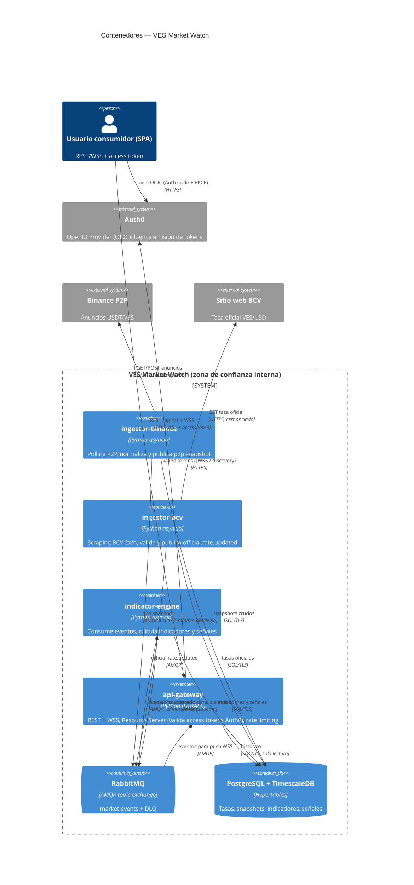

# C4 — Diagrama de Contenedores

**Trust boundaries:**

0. Usuario ↔ Auth0 ↔ api-gateway: identidad delegada a Auth0 (OIDC); el gateway solo acepta
   access tokens válidos (firma JWKS, `iss`/`aud`). No emite tokens ni guarda credenciales.
1. Internet ↔ api-gateway: única entrada de data; access token + rate limiting + TLS.
2. Fuentes externas ↔ ingestores: datos no confiables; validación de esquema y rango.
3. Servicios ↔ RabbitMQ: usuarios AMQP dedicados por servicio con permisos mínimos
   (los ingestores solo publican; el engine consume y publica; el gateway solo consume).
4. Servicios ↔ DB: roles PostgreSQL separados por servicio (mínimo privilegio).
