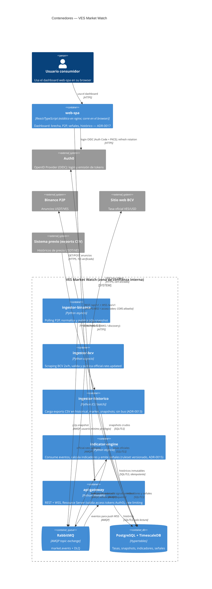

# C4 — Diagrama de Contenedores

- **Estado:** approved (Gate 1, HITL 2026-07-11)
- **Fecha:** 2026-07-27
- **Decisores:** Jeremi Alcalá
- **Fase AI-DLC:** 02-design
- **Versión:** 0.4.0

*(Eje de estructura — contenedores y trust boundaries del threat model)*

```mermaid
C4Container
  title Contenedores — VES Market Watch

  Person(consumerDev, "Usuario consumidor", "Usa el dashboard web-spa en su browser")
  Container(spa, "web-spa", "React/TypeScript (estático en nginx; corre en el browser)", "Dashboard: brecha, P2P, señales, histórico — ADR-0017")
  System_Ext(auth0, "Auth0", "OpenID Provider (OIDC): login y emisión de tokens")
  System_Ext(binance, "Binance P2P", "Anuncios USDT/VES")
  System_Ext(bcv, "Sitio web BCV", "Tasa oficial VES/USD")
  System_Ext(legacy, "Sistema previo (exports CSV)", "Históricos de precio USDT/VES")

  System_Boundary(vmw, "VES Market Watch (zona de confianza interna)") {
    Container(ingBin, "ingestor-binance", "Python asyncio", "Polling P2P, normaliza y publica p2p.snapshot")
    Container(ingBcv, "ingestor-bcv", "Python asyncio", "Scraping BCV 2x/h, valida y publica official.rate.updated")
    Container(ingHist, "ingestor-historico", "Python (CLI batch)", "Carga exports CSV en historical_market_snapshots; sin bus (ADR-0013)")
    Container(engine, "indicator-engine", "Python asyncio", "Consume eventos, calcula indicadores y emite señales (ruleset versionado, ADR-0015)")
    Container(gateway, "api-gateway", "Python (FastAPI)", "REST + WSS, Resource Server (valida access tokens Auth0), rate limiting")
    ContainerQueue(mq, "RabbitMQ", "AMQP topic exchange", "market.events + DLQ")
    ContainerDb(db, "PostgreSQL + TimescaleDB", "Hypertables", "Tasas, snapshots, indicadores, señales")
  }

  Rel(ingBin, binance, "GET/POST anuncios", "HTTPS, TLS verificado")
  Rel(ingBcv, bcv, "GET tasa oficial", "HTTPS, cert anclado")
  Rel(ingBin, mq, "p2p.snapshot", "AMQP, usuario mínimo privilegio")
  Rel(ingBcv, mq, "official.rate.updated", "AMQP")
  Rel(mq, engine, "eventos de mercado", "AMQP, validación de esquema")
  Rel(engine, mq, "indicators.updated / signals.emitted", "AMQP")
  Rel(mq, gateway, "eventos para push WSS", "AMQP")
  Rel(legacy, ingHist, "export CSV por lote", "archivo local, CLI")
  Rel(ingHist, db, "históricos inmutables", "SQL/TLS, idempotente")
  Rel(ingBin, db, "snapshots crudos", "SQL/TLS")
  Rel(ingBcv, db, "tasas oficiales", "SQL/TLS")
  Rel(engine, db, "indicadores y señales", "SQL/TLS")
  Rel(gateway, db, "histórico", "SQL/TLS, solo lectura")
  Rel(consumerDev, spa, "usa el dashboard", "HTTPS")
  Rel(spa, auth0, "login OIDC (Auth Code + PKCE); refresh rotation", "HTTPS")
  Rel(gateway, auth0, "valida tokens (JWKS / discovery)", "HTTPS")
  Rel(spa, gateway, "REST /api/v1 + WSS /ws/v1", "HTTPS/WSS + access token; CORS allowlist")
```

**Trust boundaries:**

0. Usuario ↔ Auth0 ↔ api-gateway: identidad delegada a Auth0 (OIDC); el gateway solo acepta
   access tokens válidos (firma JWKS, `iss`/`aud`). No emite tokens ni guarda credenciales.
   El `web-spa` corre EN el browser del usuario (zona no confiable aunque el código sea
   nuestro): tokens solo en memoria + rotation + CSP (T12), y el gateway solo acepta
   orígenes de la allowlist CORS (T15) — ADR-0017.
1. Internet ↔ api-gateway: única entrada de data; access token + rate limiting + TLS.
2. Fuentes externas ↔ ingestores: datos no confiables; validación de esquema y rango
   (incluye los exports CSV del ingestor-historico: parseo con rechazo/descarte, T14).
3. Servicios ↔ RabbitMQ: usuarios AMQP dedicados por servicio con permisos mínimos
   (los ingestores solo publican; el engine consume y publica; el gateway solo consume).
4. Servicios ↔ DB: roles PostgreSQL separados por servicio (mínimo privilegio).
