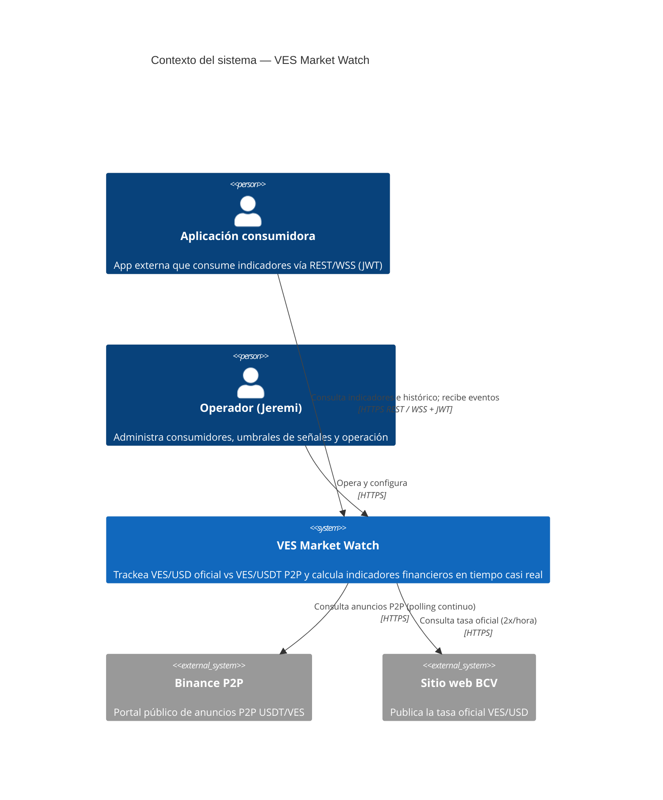

# C4 — Diagrama de Contexto

**Trust boundaries:** todo lo externo (Binance, BCV, apps consumidoras) es no confiable.
Las respuestas de Binance/BCV se validan antes de entrar al dominio; los consumidores
solo acceden autenticados a través del api-gateway.
