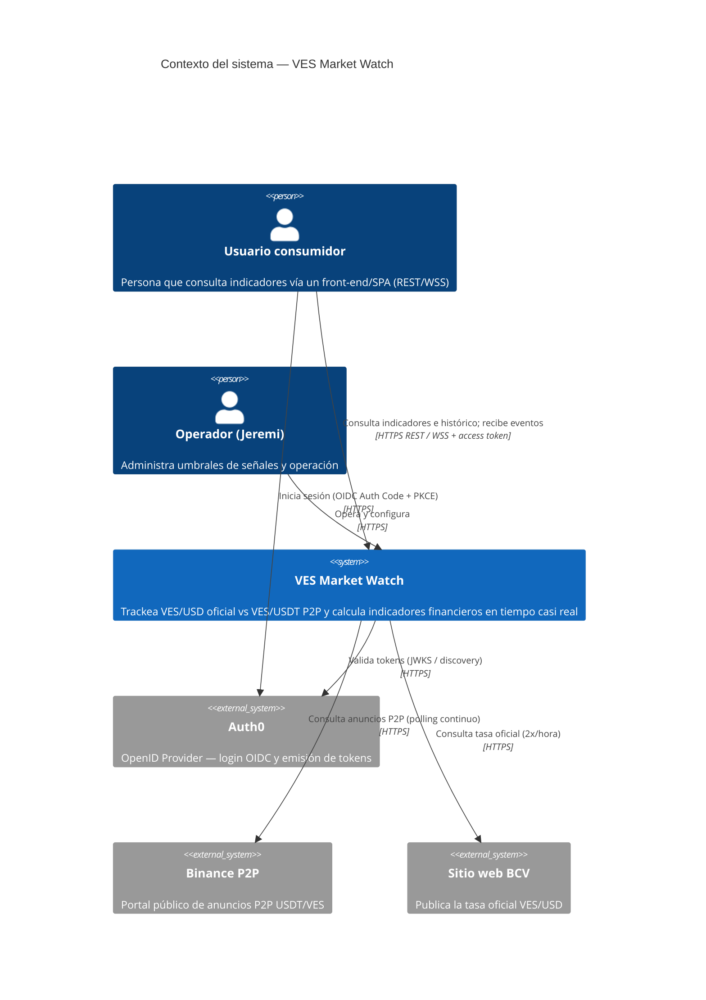

# C4 — Diagrama de Contexto

**Trust boundaries:** todo lo externo (Auth0, Binance, BCV, usuarios) es no confiable. Las
respuestas de Binance/BCV se validan antes de entrar al dominio; los usuarios se autentican
en Auth0 y solo acceden con un access token válido a través del api-gateway, que verifica su
firma y audiencia contra el JWKS de Auth0.
